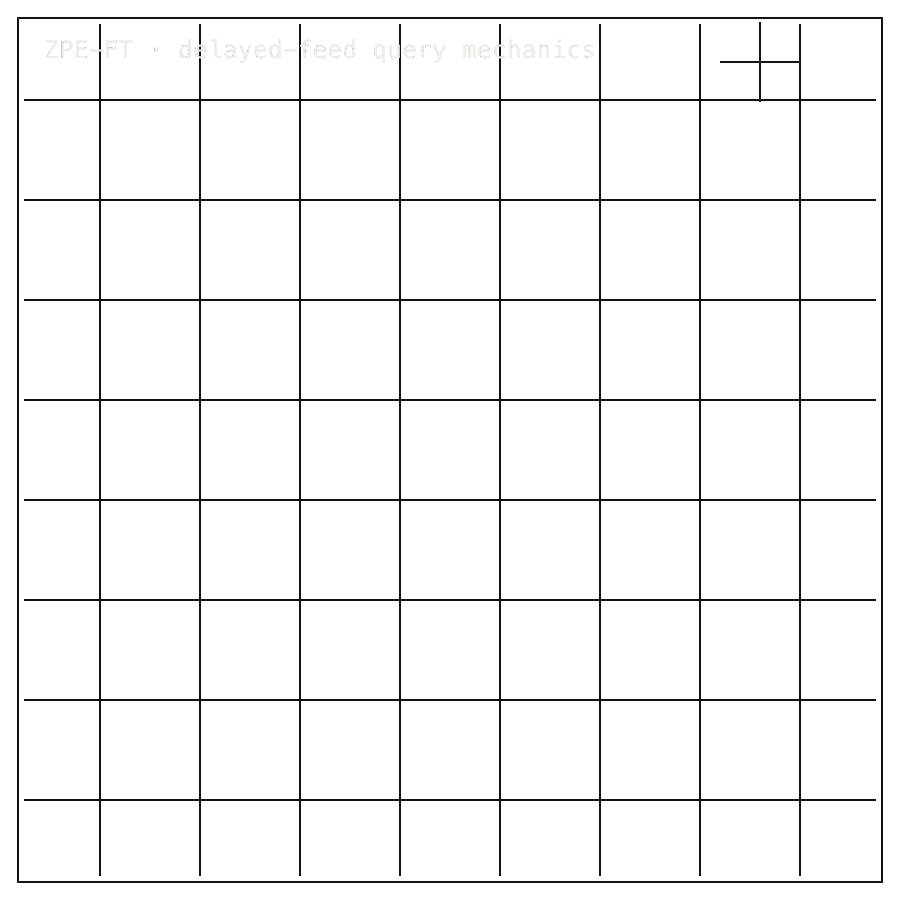

# ZPE-FT

## 0. Install / Developer Commands

#### Quick Start

Install from PyPI:

```bash
pip install zpe-ft
```

Verify from source:

```bash
git clone https://github.com/Zer0pa/ZPE-FT.git
cd ZPE-FT
python -m venv .venv
source .venv/bin/activate
python -m pip install -U pip
python -m pip install -e .
python - <<'PY'
import zpe_finance
from zpe_finance.rust_bridge import rust_version
print("exports", sorted(zpe_finance.__all__))
print("rust_bridge", rust_version())
PY
```

Start with `docs/ARCHITECTURE.md`, then read `docs/LEGAL_BOUNDARIES.md` and `proofs/reruns/2026-03-21_phase06_contract_freeze_attempt_v3/missing_inputs_packet.json`. `LICENSE` is the legal source of truth; the repo uses SAL v7.1.

<table>
<tr>
<td colspan="7" valign="top">
<sub>01 · Bento cell · b-cell b-hero cell-7 row-2</sub>
<div><span><b>00 · ZPE-FT</b> · FINANCIAL TIME-SERIES</span><span>DEVELOPER-READY · PHASE 06 PENDING</span></div>
      <h1><span>Self-Aware</span> Market Data</h1>
      <p>A compression codec for delayed-feed market archives &mdash; compact, exact, queryable · ZPE-FT · PyPI <em>zpe-ft</em> v0.1.1 · github.com/Zer0pa/ZPE-FT</p>
      <p>Market archives store rows well. They rarely retain the price pattern. Finding a six-month-old chart shape today means rebuilding from scratch, not retrieving. ZPE-FT compresses delayed and public feeds <strong>5.9&ndash;10.9&times;</strong> smaller than raw, replays price fields at <strong>RMSE = 0.0</strong>, and runs OHLCV pattern queries up to <strong>62.9&times;</strong> faster than Parquet+zstd through DuckDB. The public-corpus result is real. The enterprise benchmark still waits on Phase 06 inputs and FT-C004 labels.</p>
</td>
<td colspan="5" valign="top">
<sub>02 · ZPE FT animated mechanics diagram · b-cell b-codec-mechanics cell-5 row-2</sub>
<figure>
        <div></div>
        <figcaption><b>Scope:</b> delayed/public archive. Price fields replay exactly; Phase 06 enterprise inputs and FT-C004 labels remain pending.</figcaption>
      </figure>
</td>
</tr>
<tr>
<td colspan="4" valign="top">
<sub>03 · Bento cell · b-cell b-title cell-4</sub>
<div><b>01 · THE GAP</b><span>STORED, NOT KNOWN</span></div>
      <h2>A market archive stores what happened. It does not remember what price did.</h2>
</td>
<td colspan="5" valign="top">
<sub>04 · Bento cell · b-cell b-fig cell-5</sub>
<div><b>02 · MARKETS</b><span>ADJACENT FORECASTS</span></div>
      <div>
        <div>
          <div><span>Market data '30</span><span></span><span>$52.1B</span></div>
          <div><span>Fintech analytics '30</span><span></span><span>$45.6B</span></div>
          <div><span>Capital markets software '30</span><span></span><span>$31.4B</span></div>
          <div><span>Time-series database '30</span><span></span><span>$5.7B</span></div>
          <div><span>Financial data infrastructure '31</span><span></span><span>$78.9B</span></div>
        </div>
      </div>
      <div>Capital-markets data and analytics forecasts. Every tool listed above still pays the storage and rebuild cost that ZPE-FT removes from the file itself.</div>
</td>
<td colspan="3" valign="top">
<sub>05 · Bento cell · b-cell b-stat cell-3</sub>
<div><b>03 · VALUE</b></div>
      <div>$78.9<span>B</span></div>
      <div>Financial data infrastructure keeps growing. The storage and search bill on delayed-feed history is the line item nobody has solved.</div>
</td>
</tr>
<tr>
<td colspan="3" valign="top">
<sub>06 · Bento cell · b-cell b-title is-centered cell-3</sub>
<div><b>04 · INSIGHT</b></div>
      <h2>Encode the pattern. The archive <span>knows its shape.</span></h2>
</td>
</tr>
<tr>
<td colspan="12" valign="top">
<sub>07 · Bento cell · b-cell b-prose is-technical b-tech-panel</sub>
<div><b>05.1 · CURRENT TECH</b><span>STORED AND REBUILT</span></div>
        <p>Delayed market data lives in raw CSV, Parquet+zstd, or vendor stores. Cheap to write, fast to scan. But the file holds bytes, not patterns. Asking what a price <em>did</em> means rebuilding the answer, not retrieving it.</p>
</td>
</tr>
<tr>
<td colspan="12" valign="top">
<sub>08 · Bento cell · b-cell b-prose is-technical b-tech-panel</sub>
<div><b>05.2 · OUR TECH</b><span>ENCODE THE PATTERN</span></div>
        <p>ZPE-FT encodes pattern structure into the archive itself. Price fields replay at <strong>RMSE 0.0</strong>. OHLCV pattern queries run up to <strong>62.9&times; faster</strong> than Parquet+zstd through DuckDB. SPY 10-year: <strong>5.94&times;</strong> smaller. Binance BTC aggTrades: <strong>10.90&times;</strong>. Kaggle SPY full history: <strong>7.31&times;</strong>. Public, delayed-feed corpora only.</p>
</td>
</tr>
<tr>
<td colspan="3" valign="top">
<sub>09 · Bento cell · b-cell b-fig b-benchmark-mini cell-3</sub>
<div><b>05.3 · BENCHMARKS</b><span>DELAYED-FEED PUBLIC CORPORA</span></div>
      <div>
        <div>
          <div><span>SPY 10y</span><b>5.94</b><small>&times; vs raw</small></div>
          <div><span>BTC tick</span><b>10.90</b><small>&times; vs raw</small></div>
          <div><span>Kaggle SPY</span><b>7.31</b><small>&times; vs raw</small></div>
          <div><span>Price RMSE</span><b>0.0</b><small>reported fields</small></div>
        </div>
        <div>
          <div><span>SPY</span><span></span><span>5.94&times;</span></div>
          <div><span>BTC</span><span></span><span>10.90&times;</span></div>
          <div><span>Kaggle</span><span></span><span>7.31&times;</span></div>
        </div>
      </div>
      <div><b>Status:</b> three public corpora stand &middot; Phase 06 enterprise benchmark and FT-C004 labels pending.</div>
</td>
<td colspan="4" valign="top">
<sub>10 · Bento cell · b-cell b-title cell-4</sub>
<div><b>06 · MEASUREMENT</b><span>PHASE3 PUBLIC BENCHMARKS</span></div>
      <h2>Three public corpora stand. <span>Phase 06 still needs its inputs.</span></h2>
</td>
</tr>
<tr>
<td colspan="8" valign="top">
<sub>11 · Bento cell · b-cell b-fig cell-8</sub>
<div><b>06.1 · COMPARATIVE PERFORMANCE · DELAYED-FEED VS RAW</b></div>
      <div>
        <div>
          <div><span>SPY 10y</span><span></span><span><strong>5.94&times; smaller</strong></span></div>
          <div><span>BTC aggTrades</span><span></span><span><strong>10.90&times;</strong></span></div>
          <div><span>Kaggle SPY</span><span></span><span><strong>7.31&times;</strong></span></div>
          <div><span>Phase 06</span><span></span><span><em>pending</em></span></div>
        </div>
      </div>
      <div>Yahoo SPY 10y, Binance BTCUSDT aggTrades, Kaggle SPY full history &mdash; all delayed feed. Reported price fields replay exactly. BTC tick data wins on size but not on query speed; no latency claim is made there. Phase 06 inputs and FT-C004 truth labels remain unresolved.</div>
</td>
</tr>
<tr>
<td colspan="12" valign="top">
<sub>12 · Bento cell · b-cell b-row-label cell-12</sub>
<div><b>07 · KEY METRICS</b><span>DELAYED-FEED CORPORA</span></div>
</td>
</tr>
<tr>
<td colspan="12" valign="top">
<sub>13 · Bento cell · b-cell b-stat</sub>
<div><b>07.1 · SPY 10y</b></div>
      <div>5.94<span>&times;</span></div>
      <div>vs raw &middot; <b>Yahoo Finance daily</b></div>
</td>
</tr>
<tr>
<td colspan="12" valign="top">
<sub>14 · Bento cell · b-cell b-stat</sub>
<div><b>07.2 · BTC TICK</b></div>
      <div>10.90<span>&times;</span></div>
      <div>vs raw &middot; <b>Binance public aggTrades</b></div>
</td>
</tr>
<tr>
<td colspan="12" valign="top">
<sub>15 · Bento cell · b-cell b-stat</sub>
<div><b>07.3 · KAGGLE SPY</b></div>
      <div>7.31<span>&times;</span></div>
      <div>vs raw &middot; <b>Kaggle full history</b></div>
</td>
</tr>
<tr>
<td colspan="12" valign="top">
<sub>16 · Bento cell · b-cell b-stat</sub>
<div><b>07.4 · PROXY RMSE</b></div>
      <div>0.0<span>ticks</span></div>
      <div>price fields &middot; <b>public proxy corpus</b></div>
</td>
</tr>
<tr>
<td colspan="12" valign="top">
<sub>17 · Bento cell · b-cell b-stat</sub>
<div><b>07.5 · SOVEREIGN</b></div>
      <div>null</div>
      <div>Enterprise metric pending &middot; <b>Phase 06 inputs open</b></div>
</td>
</tr>
<tr>
<td colspan="4" valign="top">
<sub>18 · Bento cell · b-cell b-title is-centered cell-4</sub>
<div><b>08 · FIDELITY</b><span>PRICE FIELDS VS VOLUME</span></div>
      <h2>Price fields replay exactly. <span>RMSE = 0.0 decides.</span></h2>
</td>
<td colspan="5" valign="top">
<sub>19 · Bento cell · b-cell b-prose is-technical cell-5</sub>
<div><b>08.1 · WHAT EXACT REPLAY MEANS</b><span>PUBLIC PROXY SCOPE</span></div>
      <p>The 62.9&times; figure is the p95 query latency win on Yahoo SPY OHLCV versus Parquet+zstd through DuckDB. BTC aggTrades is size-positive at latency parity or slower &mdash; no latency win is claimed on tick data. Price-field RMSE = 0.0 holds on reported fields across all three public corpora. Deterministic replay is declared on public inputs with committed benchmark artifacts in the repo. Anyone with the corpora can rerun the numbers and get the same bytes. Phase 06 enterprise inputs remain missing. FT-C004 retrieval truth labels remain unresolved.</p>
</td>
<td colspan="3" valign="top">
<sub>20 · Bento cell · b-cell b-blocker cell-3</sub>
<div><b>08.2 · HONEST BLOCKER</b></div>
      <span>Honest Blocker &middot;</span>
      <p><strong>Public-corpus benchmarks are not the enterprise benchmark.</strong> Phase 06 still needs <strong>33 missing input series</strong> and unresolved <strong>FT-C004 truth labels</strong>. ZPE-FT is not a real-time feed, not a trading system, and makes no lossless volume claim. PyPI ships v0.1.1; v0.1.2 is pending.</p>
</td>
</tr>
<tr>
<td colspan="4" valign="top">
<sub>21 · Bento cell · b-cell b-title cell-4</sub>
<div><b>09</b></div>
      <h2>FIVE FUTURES FROM ONE <span>DELAYED-FEED ARCHIVE.</span></h2>
</td>
<td colspan="4" valign="top">
<sub>22 · Bento cell · b-cell b-prose cell-4</sub>
<div><b>09.1 · THE AMBITION</b></div>
      <p>The bet is not to beat the warehouse. The bet is that a market archive can stay compact, exact, and queryable at the same time &mdash; and that when delayed-feed history behaves that way, the warehouse stops being the only place a fintech team is allowed to ask questions.</p>
</td>
</tr>
<tr>
<td colspan="12" valign="top">
<sub>23 · Bento cell · b-cell b-title b-statement-card</sub>
<div><b>09.2 · WHAT WORKS NOW</b></div>
        <h2>Today, on three public corpora: 5.94&ndash;10.90&times; compression, RMSE 0.0 on price fields, 62.9&times; OHLCV query win.</h2>
</td>
</tr>
<tr>
<td colspan="12" valign="top">
<sub>24 · Bento cell · b-cell b-title b-statement-card</sub>
<div><b>09.3 · WHAT'S STILL OPEN</b></div>
        <h2>Still open: Phase 06 enterprise inputs, FT-C004 retrieval labels, the private-data benchmark, and PyPI v0.1.2.</h2>
</td>
</tr>
<tr>
<td colspan="12" valign="top">
<sub>25 · Bento cell · b-cell b-unlock</sub>
<div><b>09.4</b> &middot; ARCHIVES · NEAR-TERM (12&ndash;24 MO)</div>
      <div>More history fits in the same budget</div><div>A data team that cuts delayed-feed storage by six to eleven times can keep ten years of tick history where they used to keep one. The retention conversation shifts from &ldquo;what do we drop&rdquo; to &ldquo;what do we still ask of it.&rdquo;</div>
</td>
</tr>
<tr>
<td colspan="12" valign="top">
<sub>26 · Bento cell · b-cell b-unlock</sub>
<div><b>09.5</b> &middot; QUERIES · NEAR-TERM (12&ndash;24 MO)</div>
      <div>Pattern search runs on the archive</div><div>An analyst hunting a price pattern from three years ago does not stage a fresh DuckDB rebuild first. The query goes against the compressed file. Backtest setup and exploratory research move from hours of preparation toward a single command.</div>
</td>
</tr>
<tr>
<td colspan="12" valign="top">
<sub>27 · Bento cell · b-cell b-unlock</sub>
<div><b>09.6</b> &middot; FIDELITY · MID-TERM (24&ndash;48 MO)</div>
      <div>Every price still matches exactly</div><div>A compliance reviewer who asks whether the archived close equals the source close gets a zero-difference answer on reported price fields. Compaction stops carrying the usual quiet trust tax, which makes long-horizon market archives easier to defend.</div>
</td>
</tr>
<tr>
<td colspan="12" valign="top">
<sub>28 · Bento cell · b-cell b-unlock</sub>
<div><b>09.7</b> &middot; TRUTH · MID-TERM (24&ndash;48 MO)</div>
      <div>Retrieval claims wait for labels</div><div>The pending FT-C004 label set is the gate that decides whether &ldquo;we found this pattern&rdquo; is allowed to graduate into a product feature. Buyers see retrieval evaluated against a fixed reference, not against the vendor&rsquo;s own examples.</div>
</td>
</tr>
<tr>
<td colspan="12" valign="top">
<sub>29 · Bento cell · b-cell b-unlock</sub>
<div><b>09.8</b> &middot; PARADIGM &middot; PARADIGM (48 MO+)</div>
      <div>Market archives become query-native</div><div>If exact replay and low-latency search stay coupled once enterprise data joins the picture, delayed-feed history stops being cold storage that warehouses must rebuild from. It becomes the searchable layer that fintech analytics sits on top of.</div>
</td>
</tr>
</table>
