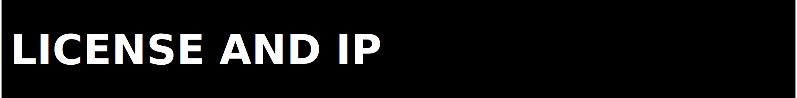

  

# Legal Boundaries

  

## License Source Of Truth

[`LICENSE`](../LICENSE) is the legal source of truth.

This repo is distributed under Zer0pa Source-Available License v6.2. It is not
an OSI open-source license.

## Covered Surfaces

| Surface | Current reading |
|---|---|
| Source code | In scope under the repo license |
| Documentation | In scope under the repo license |
| Shipped proof artifacts | Distributed as repo content under [`LICENSE`](../LICENSE), while underlying data provenance and usage notes remain artifact-specific |
| Historical reruns, copied contract refs, and operator prompts | Retained only where needed for evidence or execution context; some include third-party outputs or machine-local traces and are not a blanket relicensing of every embedded output |

## Data And Evidence Boundaries

| Artifact family | Boundary |
|---|---|
| `2026-02-21_ft_wave1_final` | carried controlled proof bundle |
| `2026-03-19_alpaca_demo_smoke` | internal delayed-feed qualification only |
| `2026-03-21_phase06_contract_freeze_attempt_v3` | benchmark-blocker packet, not a market-rights grant |

## Historical Proof Caveat

Some preserved proof files and copied contract references contain third-party
tool outputs, machine-local paths, workstation-specific error signatures, or
superseded license/status wording from the time they were captured. Keep them
as evidence artifacts or operator-local context, not as current operating
instructions or a broad rights statement over every embedded external output.

  

