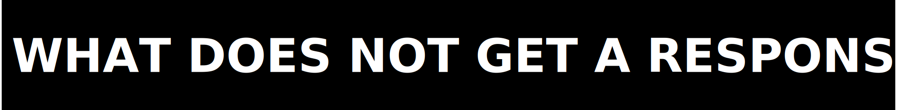

  

# Support

  

| What you need | Where to go |
|---|---|
| Package or docs bug | private repo issue with the exact file path and command |
| Evidence dispute | private repo issue with the contradicted artifact path |
| Security vulnerability | `architects@zer0pa.ai` |
| Licensing or commercial question | `architects@zer0pa.ai`; [`LICENSE`](../LICENSE) is the legal source of truth |
| Contribution guidance | [`../CONTRIBUTING.md`](../CONTRIBUTING.md) |
| Release posture question | [`../RELEASING.md`](../RELEASING.md) |
| Common reader question | [`FAQ.md`](FAQ.md) |

  

- a reproducible command
- a concrete artifact path
- a rendered-doc path problem
- a precise contradiction between prose and shipped evidence

  

- requests to upgrade bounded evidence into broader authority without new proof
- claims disputes with no counter-evidence
- questions already answered in the root README or FAQ

  

This repo does not promise a public SLA in documentation. Security and evidence
contradictions are treated as higher priority than general questions.
