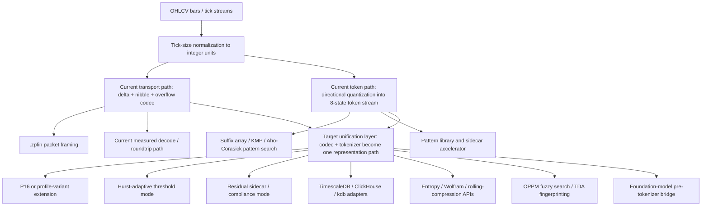

> Retained context copy for the March 21 blocker packet. Original machine-local
> paths are intentionally preserved in this copied reference; do not treat this
> file as the current public instruction surface for the repo.

# ZPE-FT - ZER0PA Innovation PRD
Sector: ZPE FT
Sector Folder: /Users/Zer0pa/ZPE/Zer0pa PRD & Research/ZPE FT/
Document Class: SECTOR_SPECIFIC_PRD
Version: 0.4.1
Created: 2026-03-18
Last Modified: 2026-03-18
Status: BASELINE_FROZEN_EXECUTION_READY
PRD Class: IMMUTABLE_CHARTER + MUTABLE_EXPERIMENT_PROGRAM
Source Corpus: /Users/Zer0pa/ZPE/Zer0pa PRD & Research/ZPE FT/output/research_pack_index.md
Authority Metric: AM-C05_FROZEN - compressed-space motif-query p95 latency on the frozen single-core workload, with compression, fidelity, search quality, and roundtrip integrity held as hard guardrails
Comparator State: FROZEN_NARROW_LANE
PRD Hash: DECISION_FROZEN_2026-03-18

<!-- HISTORY
[2026-03-18] v0.0.0 -> v0.1.0: First canonical concept-stage FT PRD assembled from the extractor surface, control docs, and targeted source re-reads. No authority metric, comparator set, dataset suite, environment authority, licensing boundary, or startup-control artifact package is frozen yet.
[2026-03-18] v0.1.0 -> v0.1.1: Verifier pass corrected Section 11 artifact-contract drift by removing unsupported supplemental P1 blockers and restoring the canonical Comet pointer row. No freeze-package item was closed.
[2026-03-18] v0.1.1 -> v0.2.0: Augmenter-refiner pass hardened authoring-state visibility, verifier/refiner artifact surfacing, and handoff usability without changing unresolved freeze, licensing, or evidence blockers.
[2026-03-18] v0.2.0 -> v0.3.0: Stripped authoring-chain residue out of the active control surface, singularized the first-lane FT product boundary, and demoted drafter/verifier/refiner artifacts to archival provenance instead of execution requirements.
[2026-03-18] v0.3.0 -> v0.4.0: Finalized the narrow enterprise lane using the local SAL license, the legacy FT evidence bundle, the legacy execution repo, and current market-landscape research; created the startup-control package and froze the first executable utility boundary.
[2026-03-18] v0.4.0 -> v0.4.1: Added the repo-native commercial corpus execution path: explicit real-market corpus JSON contract, freeze and refresh command chain, active runbook expansion, and a non-fabricated rule for real-market search-quality scoring.
-->

Charter split note:
- Provisional immutable charter surface for concept stage: Sections 0-3, 5, 7, 10, 14, 15, 15A-15E, and 16.
- Mutable experiment program surface: Sections 4, 6, 8, 9, 11, 12, and 13.
- Concept-stage charter boundary: first-lane closure is `zpe-finance`, backed by `.zpfin` and proven by `pattern-library` on the frozen measured workload. `sidecar-accelerator` is the first deployment wedge after core closure. DB adapters, wider query surfaces, and foundation-model bridges remain explicit follow-on or separate-lane surfaces rather than silently deleted scope.
- Execution-repo note: control-plane docs and state live in `/Users/Zer0pa/ZPE/Zer0pa PRD & Research/ZPE FT/`. The active implementation repo for the frozen first lane is `/Users/Zer0pa/ZPE/ZPE FT/zpe-finance/`, with the final PRD mirrored into `/Users/Zer0pa/ZPE/ZPE FT/`.

## 1. Mission and Structural Thesis

### 1.1 One-Sentence Mission
Treat ZPE-FT first as an enterprise-grade finance-native codec and search infrastructure program: ship `zpe-finance`, back it with `.zpfin`, prove compressed-space pattern retrieval and deterministic roundtrip through `pattern-library` on the frozen measured workload, and only widen into `sidecar-accelerator`, DB adapters, or model-tokenizer bridges if later evidence justifies that escalation.

Parallel source mission candidates that remain active:
- FT-C1: finance-native compression and geometric encoding layer for OHLCV and tick data.
- FT-C1: codec and query engine for price trajectories, not a trading model or market simulator.
- FT-C1: compressed-space geometric pattern search without full decompression.
- FT-E1: compact financial transport or codec layer plus directional symbolic representation plus narrow native kernel.
- FT-E1: narrow finance-native component rather than broad TSDB replacement.
- FT-S1: lossless compression plus geometric pattern-search codec with staged sidecar and adapter expansion.
- FT-C1 plus FT-S1: deterministic pre-tokenizer bridge for PLUTUS or Kronos-like models as a later expansion lane.

### 1.2 Structural Thesis
Source-grounded thesis surface:
- EXPLICIT / FT-C1: financial price action can be represented as a directional geometric language rather than raw floating-point deltas alone.
- EXPLICIT / FT-C1: compression and pattern retrieval should be the same representational layer rather than two unrelated post-hoc systems.
- EXPLICIT / FT-C1: tick-size normalization is the correct finance-native normalization basis across instruments.
- EXPLICIT / FT-C1: searchability without decompression is part of the artifact’s core value, not a side benefit.
- EXPLICIT / FT-E1: the current live packet codec and the 8-state token search layer are not yet actually the same path.
- EXPLICIT / FT-E1: FT’s real advantage is specialization, determinism, and motif retrieval rather than general database breadth.
- EXPLICIT / FT-S1: P16 and other primitive-count changes are profile variants, not new architectures.
- EXPLICIT / FT-S1: the primary current execution frontier is unifying codec and tokenizer without rebuilding the green core codec from scratch.
- EXPLICIT / FT-S1: several frontier-finance bridges remain admissible extension lanes, including entropy regimes, Wolfram complexity, rolling compression complexity, TDA fingerprints, OPPM fuzzy search, and deterministic foundation-model token bridges.
- EXPLICIT / FT-C1: multi-resolution, streaming ingest, compliance-mode residuals, and correlation-aware multi-asset compression remain concept-stage but source-grounded architectural surfaces.

Cross-source synthesis kept visible as inference:
- INFERENCE: the strongest architectural ladder across the corpus is deterministic finance-native codec -> compressed-space motif search -> codec/tokenizer unification -> overflow or compliance hardening -> sidecar and adapter insertion -> optional deterministic pre-tokenizer or analytics APIs.
- INFERENCE: the cleanest current truth surface is narrower than the concept surface, so ratification should privilege measured core behavior over the broader concept narrative unless freeze-package evidence widens scope explicitly.

### 1.3 Falsification Condition
Source-grounded falsification envelope:
- EXPLICIT / FT-C1 plus FT-E1: if the core library cannot preserve strong compression, fidelity, and compressed-space search together on frozen benchmark corpora, the finance-native codec thesis weakens sharply.
- EXPLICIT / FT-E1 plus FT-S1: if codec and tokenizer cannot be unified without materially degrading the measured green-core surface, the unification thesis weakens materially.
- EXPLICIT / FT-E1: if motif retrieval proves too narrow to justify meaningful differentiation against frozen baselines and sidecar deployment paths, the search-led wedge weakens materially.
- EXPLICIT / FT-S1: if overflow, compliance, or regime-break handling cannot be solved without abandoning deterministic zero-ML codec behavior, the current architectural thesis weakens materially.
- EXPLICIT / FT-E1 plus FT-S1: if DB adapters or model-tokenizer bridges require materially different datasets, comparator families, or semantics boundaries than the narrow codec/search lane, the broader platform thesis remains follow-on or separate-lane work rather than first-lane closure.
- OPEN_QUESTION: the corpus does not yet define exact lane-kill thresholds for unification, overflow or compliance control, or adapter or pre-tokenizer expansion.

Operationalized concept-stage pivot rule (INFERENCE; verifier attack required):
- Keep the lane narrow rather than broadening the narrative if the first frozen codec/search authority metric is missed after the declared fix-cycle limit.
- Park DB-adapter, multi-asset, or model-bridge surfaces if they require broader evidence than the measured current core can support.
- Do not narrate a partial adapter or model-bridge result into whole-lane readiness.

### 1.4 Agent-Readable Brief
ZPE-FT is now a frozen execution charter for a narrow finance-native utility lane. The concept doc frames the larger search space. The evaluation summary and Wave 1 supplement identify the narrow measured truth. The legacy FT evidence bundle and execution repo show what actually ran, what passed, and where the lane remains narrow. The local SAL license resolves the legal boundary. This PRD therefore locks one executable wedge: `zpe-finance` plus `.zpfin` plus `pattern-library`, with `sidecar-accelerator` as the first deployment proof. It preserves wider adapters and bridges as explicit parked or follow-on lanes rather than silently deleting them.

### 1.5 Superordinate Goal
Resolved for the first frozen lane:
- SG-01: ship `zpe-finance` as an enterprise-grade, drop-in finance-native codec and compressed-space motif-search utility rather than a full TSDB replacement.
- SG-02: preserve or exceed the carried narrow-lane evidence surface of ~19.19x OHLCV compression, ~20.57x tick compression, exact-lossless reconstruction on the carried run, mean `P@10 = 0.9`, and `p95 = 0.0567 ms` motif-query latency on the frozen benchmark workload.
- SG-03: make the first commercial wedge a utility or sidecar that integrates into existing finance data pipelines with minimal surface-area replacement.
- SG-04: treat broader adapters, P16, overflow hardening, and model-tokenizer bridges as explicit parked or follow-on programs that may not borrow first-lane closure by rhetoric.
- SG-05: refuse platform-replacement or broad market-superiority claims until the narrow lane is rerun on a frozen commercial-safe real-market corpus and a declared deployment target.
- SG-06: treat the carried narrow-lane evidence as the minimum acceptable starting surface, not the success ceiling; every future execution loop is expected to defend or exceed it on more commercially meaningful workloads.

## 2. Scope and Boundaries

### 2.1 In-Scope Artifacts
| Artifact | Type | Lane | Target Path | State |
|----------|------|------|-------------|-------|
| zpe-finance | library | L1 | /Users/Zer0pa/ZPE/ZPE FT/zpe-finance/ | FIRST_LANE_PRODUCT |
| zpfin-transport | protocol | L1 | /Users/Zer0pa/ZPE/ZPE FT/format/ZPFIN_SPEC.md | FIRST_LANE_TRANSPORT_PREREQUISITE |
| rust-codec-search-kernel | code | L1 | /Users/Zer0pa/ZPE/ZPE FT/zpe-finance/core/ | INTERNAL_FIRST_LANE_SUBSTRATE |
| pattern-library | retrieval surface | L1 | /Users/Zer0pa/ZPE/ZPE FT/zpe-finance/python/zpe_finance/ | FIRST_LANE_VALUE_PROOF |
| sidecar-accelerator | integration | L1 | /Users/Zer0pa/ZPE/ZPE FT/artifacts/2026-02-21_zpe_ft_wave1_final/zipline_roundtrip_results.json | FOLLOW_ON_DEPLOYMENT_WEDGE |
| timescaledb-extension | adapter | L1 | /Users/Zer0pa/ZPE/ZPE FT/zpe-finance/docs/adapters/timescaledb/ | FOLLOW_ON_ADAPTER |
| clickhouse-codec | adapter | L1 | /Users/Zer0pa/ZPE/ZPE FT/zpe-finance/docs/adapters/clickhouse/ | FOLLOW_ON_ADAPTER |
| kdb-q-wrapper | adapter | L1 | /Users/Zer0pa/ZPE/ZPE FT/zpe-finance/docs/adapters/kdb/ | FOLLOW_ON_ADAPTER |
| foundation-model-pretokenizer-bridge | model interface | L1 | /Users/Zer0pa/ZPE/ZPE FT/zpe-finance/docs/bridges/foundation-model/ | SEPARATE_LANE_OR_MAXIMALIZATION |

### 2.2 Out-of-Scope (Explicit)
- Trading strategies, price prediction, market simulation, or learned models inside the core codec.
- Wholesale replacement of TimescaleDB, QuestDB, ClickHouse, InfluxDB, or kdb+ in the first ratified lane.
- Presenting the concept doc’s broader adapter and acquisition rhetoric as already-evidenced current behavior.
- Treating the frozen synthetic-corpus evidence bundle as proof of broad market dominance, full TSDB replacement, or real-market production readiness.
- Writing FT sector outputs outside /Users/Zer0pa/ZPE/Zer0pa PRD & Research/ZPE FT/.

### 2.3 Sector Boundary and Document Locality
- Sector-specific PRDs, research, runbooks, outputs, and history live inside the sector folder.
- Root-level docs are reserved for sector-agnostic canon, methodology, alignment briefs, and cross-sector orchestration doctrine.
- A sector PRD may cite root canonical docs, but should not duplicate them wholesale.
- Sibling sector folders are read-only unless an explicit cross-sector integration phase is declared.
- The canonical execution repo for the frozen FT lane is `/Users/Zer0pa/ZPE/ZPE FT/zpe-finance/`; the outer legacy folder `/Users/Zer0pa/ZPE/ZPE FT/` holds sector-local implementation history, evidence bundles, and the mirrored final PRD.
- Frozen charter boundary: this PRD treats `zpe-finance` plus `.zpfin` plus `pattern-library` proof on the frozen measured workload as the authority-bearing closure surface. `sidecar-accelerator` is the first deployment wedge after core closure. DB adapters and foundation-model bridges remain visible, but are not first-lane authority scope.

### 2.4 Source Corpus and Coverage Matrix
| Source ID | Path | Type | Required For | Status | Notes |
|-----------|------|------|--------------|--------|-------|
| CTRL-01 | /Users/Zer0pa/ZPE/Zer0pa PRD & Research/ZER0PA_SCIENTIFIC_METHODOLOGY.md | control doc | 0, 1, 2, 4, 5, 6, 7, 8, 10, 11, 13, 14, 15, 16 | FULLY_READ + EXTRACTED + CONTROL_ONLY | Governs authority-metric sovereignty, falsification, contradiction visibility, determinism, and commercialization as a real gate. |
| CTRL-02 | /Users/Zer0pa/ZPE/Zer0pa PRD & Research/PRD_ALIGNMENT_BRIEF_2026-03-09.md | control doc | 0, 2, 4, 5, 7, 8, 11, 12, 13, 14, 15, 16 | FULLY_READ + EXTRACTED + CONTROL_ONLY | Makes immutable charter plus mutable experiment split explicit and requires startup-control artifacts. |
| CTRL-03 | /Users/Zer0pa/ZPE/Zer0pa PRD & Research/ZER0PA Innovation PRD — Canonical Format Specification.md | control doc | 0 through 16 | FULLY_READ + EXTRACTED + CONTROL_ONLY | Governs canonical section structure, provenance discipline, and readiness downgrades. |
| FT-C1 | /Users/Zer0pa/ZPE/Zer0pa PRD & Research/ZPE FT/ZPE Financial Time Series — Concept Document v1.0.md | sector source | 1, 2, 3, 4, 5, 6, 7, 11, 13, 14, 15A | FULLY_READ + EXTRACTED | Conceptual architecture, artifact stack, hard requirements, pattern-library value proposition, adapters, and commercialization. |
| FT-E1 | /Users/Zer0pa/ZPE/Zer0pa PRD & Research/ZPE FT/EXTERNAL_EVALUATION_SUMMARY_2026-03-09.md | sector source | 1, 2, 3, 5, 6, 7, 11, 14, 15A | FULLY_READ + EXTRACTED | Current measured behavior, current product boundary, benefits, shortcomings, replacement strategy, and readiness verdicts. |
| FT-S1 | /Users/Zer0pa/ZPE/Zer0pa PRD & Research/ZPE FT/ZPE-FT Wave 1 — Agent Handoff Supplement (1).md | sector source | 1, 2, 3, 4, 5, 6, 11, 13, 14, 15D, 15E | FULLY_READ + EXTRACTED | Exact primitive table, measured metrics recap, five confirmed gaps, Wave 2 code targets, anti-pattern rules, and missing authority surfaces. |
| FT-LIC-01 | /Users/Zer0pa/ZPE/Zer0pa PRD & Research/LICENSE.txt | legal authority | 3, 11, 14, 15, 15E, 16 | FULLY_READ + EXTRACTED | Governing SAL v6.0 license; resolves protected-architecture scope, hosted-service restrictions, and commercial-license boundary. |
| FT-LG-01 | /Users/Zer0pa/ZPE/ZPE FT/artifacts/2026-02-21_zpe_ft_wave1_final/ | legacy evidence bundle | 4, 5, 7, 10, 11, 14, 15 | FULLY_READ + INDEXED | Local benchmark, replay, comparator, roundtrip, Zipline, TSBS-like, and quality-gate evidence bundle adopted as current best-known narrow-lane evidence. |
| FT-LG-02 | /Users/Zer0pa/ZPE/ZPE FT/format/ZPFIN_SPEC.md | transport spec | 2, 3, 10, 15E | FULLY_READ + EXTRACTED | Current `.zpfin` framing and determinism rules. |
| FT-LG-03 | /Users/Zer0pa/ZPE/ZPE FT/runbooks/RUNBOOK_ZPE_FT_MASTER.md | legacy runbook | 4, 9, 11 | FULLY_READ + INDEXED | Execution order, seed policy, dataset lock, gate order, and evidence conventions for the legacy lane. |

### 2.5 Lane Boundaries
| Lane ID | Name | Owner Agent(s) | Folder Boundary | Integration Phase |
|---------|------|----------------|-----------------|-------------------|
| L1 | Core ZPE-FT hypothesis program | Post-ratification lane quartet | /Users/Zer0pa/ZPE/Zer0pa PRD & Research/ZPE FT/ | P5 |

Lane note:
- HF-01 through HF-16 remain active inside L1 through CAND-01 through CAND-05.
- Narrow codec plus search, unification, profile-expansion, analytics APIs, adapters, and model bridges are all still visible, but only the narrow codec-plus-search branch is currently allowed to bear first-pass closure responsibility.

### 2.6 Anti-Scope-Creep Rule
Lane boundaries are strict until the explicit integration phase declared in this table. No agent may edit sibling lane artifacts without PRD amendment. No sector PRD is ratified until every required source in Section 2.4 is marked EXTRACTED, VERIFIED, or explicitly DEFERRED with a reason. Compression, fidelity, search quality, latency, DB breadth, and commercial-adapter breadth may not be merged into one blended scorecard by prose alone.

## 3. Architecture and Component Decisions

### 3.1 System Architecture
This diagram is a cross-source assembly map. It intentionally preserves the current split between live packet codec behavior and the directional token-search path.



Architecture interpretation:
- Current source-stable truth: the live codec path is mostly delta plus nibble plus overflow, while the strongest current use of the 8-state logic is in tokenization and search.
- Conceptual target: transport and tokenization should ultimately unify into one representation path rather than remain parallel systems.
- First-lane core: deterministic compression, pattern search, and narrow roundtrip path on the existing measured workload.
- Wave 2 extension surface: P16, Hurst mode, residual sidecar, FinTSB harness, adapters, and model bridge.
- OPEN: the primitive vocabulary is not fully source-stable between the concept doc’s compass-style directional labels and the evaluation or supplement’s ordinal strong-down to very-strong-up classes.
- OPEN: multi-resolution and multi-asset correlation compression are source-grounded concept surfaces, but not current measured behavior inside this folder.

### 3.2 Component Selection
| Component | Choice | License | Rationale | Alternative Evaluated | State |
|-----------|--------|---------|-----------|----------------------|-------|
| Product core | `zpe-finance` core library with Rust hot path and Python wrapper | Zer0pa SAL v6.0 | Narrowest stable artifact identity across sources and legacy repo layout | Full TSDB replacement | SOURCE_STABLE |
| Transport | `.zpfin` packet framing over encoded bars or ticks | Zer0pa SAL v6.0 | Source-stable packet concept in FT-C1 and FT-LG-02 | Generic CSV or DB-only storage | FROZEN |
| Current live codec path | Delta + nibble + overflow | Unresolved | FT-E1 and FT-S1 describe this as current truth | Full directional transport at every field today | SOURCE_STABLE |
| Current live token path | 8-state directional token stream for pattern search | Unresolved | Current strongest use of primitive logic is in tokenization and search | No symbolic token layer | SOURCE_STABLE |
| Primitive vocabulary | 8-state price-direction alphabet, with exact wording still unstable | SAL-protected family | FT-E1 and FT-S1 provide the clearest live primitive taxonomy | Compass-style labels as ratified live spec | UNRESOLVED |
| Profile expansion | P16 price-direction x volume-regime variant | SAL-protected profile variant | FT-S1 treats it as the main microstructure fix | Leaving 8 states forever | MAXIMALIZATION_CANDIDATE |
| Overflow and compliance strategy | Hurst-adaptive widening and/or bounded residual sidecar | Unresolved | FT-S1 keeps both live as the main fix path | Abandon deterministic codec under overflow | UNRESOLVED |
| Search layer | Exact KMP or Aho-Corasick today; OPPM fuzzy extension later | Zer0pa SAL v6.0 for distributed lane artifacts | Pattern-library retrieval is current differentiation; OPPM is next fuzzy path | Full learned retrieval inside the codec | MIXED |
| Analytics extension | Entropy, Wolfram, rolling-compression, and TDA fingerprints from token streams | Unresolved | Source-grounded but not measured | No complexity or regime APIs | MAXIMALIZATION_CANDIDATE |
| DB adapter layer | TimescaleDB, ClickHouse, and kdb+/Q adapters | Mixed third-party environments, FT lane remains SAL-governed | Strong commercial wedge but incomplete today | Wholesale DB replacement | FOLLOW_ON_SCOPE |
| Model bridge | Deterministic pre-tokenizer for PLUTUS or Kronos-like models | Future FT lane remains SAL-governed; model-side terms external | Source-grounded but explicitly above the zero-ML codec | ML inside the codec | SEPARATE_LANE_OR_MAXIMALIZATION |
| ML boundary | Zero-ML deterministic core; ML only above the codec | Mixed | FT-S1 explicitly forbids ML inside the core codec | Learned codec internals | SOURCE_STABLE |

### 3.3 Environment Doctrine
| Environment | Use Case | Required Controls |
|-------------|----------|-------------------|
| Mac or Linux single-CPU host | Core codec, search, and `.zpfin` prototyping and benchmark reproduction | Fixed seeds, corpus manifests, command logs, replay hashes |
| Rust build host | Hot-path packing, unpacking, hashing, and search-kernel validation | Locked toolchain, benchmark logs, output hashes |
| Python wrapper host | API exposure, pattern library, workflow integration, and benchmark harness | Same manifests as Rust core, wrapper-to-core parity checks |
| PostgreSQL or Timescale host | Adapter and DB roundtrip validation | DB version pinning, schema fixtures, roundtrip logs |
| ClickHouse host | Codec plugin validation | Version pinning, corpus manifests, decode consistency logs |
| kdb+/Q environment | Wrapper feasibility checks | License or edition note, FFI viability logs, explicit environment disclosure |

Environment note:
- The corpus names all of the above, but it does not yet freeze which environment is authoritative for which claim family.

### 3.3A Environment Authority Freeze Surface
| Claim family | Minimum authority environment candidate | Comparator or support environment candidate | Stretch environment candidate | Freeze State |
|--------------|----------------------------------------|---------------------------------------------|-------------------------------|--------------|
| Core compression, fidelity, and search | Single-CPU Rust plus Python benchmark host with fixed seed `20260220` | SQLite path and DuckDB TSBS-like benchmark host from FT-LG-01 | none required | FROZEN |
| `.zpfin` transport and deterministic roundtrip | Same host plus `.zpfin` v1 spec and SQLite roundtrip evidence | Python wrapper parity remains desirable but non-sovereign | none required | FROZEN |
| Pattern-accelerator deployment path | Python 3.11 host with Zipline CSVDir ingest proof | Existing TSDB or lakehouse insertion remains follow-on | none declared | FROZEN_FOR_NARROW_WEDGE |
| DB adapter path | PostgreSQL or Timescale host and/or ClickHouse host | Separate benchmark host for TSBS-style comparison | kdb+/Q environment remains stretch-only | PARKED_FOLLOW_ON |
| Foundation-model pre-tokenizer bridge | Separate model-eval host | GPU or model-serving environment unresolved | none declared | PARKED_SEPARATE_LANE |

Freeze rule:
- No environment-bound claim may be promoted until one row in this surface is frozen for the relevant authority metric and comparator family.

### 3.4 Dependency and License Constraints
- The governing first-lane license is Zer0pa SAL v6.0, as read from `/Users/Zer0pa/ZPE/Zer0pa PRD & Research/LICENSE.txt` and mirrored in `/Users/Zer0pa/ZPE/ZPE FT/zpe-finance/LICENSE`.
- Protected-architecture scope covers the N-primitive directional encoding family with `N >= 2`; P8 is the canonical profile and profile changes such as P16 remain profile variants, not separate inventions.
- Hosted or managed service deployment of the FT lane, and production or commercial use above the SAL revenue threshold, require a commercial license from Zer0pa.
- Earlier MIT-core phrasing in concept-era documents is superseded for the current distributed first lane by the SAL authority surface.
- No standalone local Wave 1 Deep Research report was found. That absence is now formally indexed in `output/wave1_deep_research_index.md` and is non-blocking for the narrow first lane because the concept doc, supplement, evaluation summary, ZPFIN spec, legacy runbook, and legacy evidence bundle together close the practical execution surface.
- kdb+/Q wrapper feasibility may depend on edition-specific or licensing-specific FFI constraints not resolved locally.
- External papers, vendor benchmark blogs, and foundation-model references are admissible idea sources, not local closure evidence inside this PRD unless pulled into sector-local artifacts explicitly.
- ML may sit above the codec as an input consumer, but ML is not allowed inside the core codec for first-lane scope.

### 3.5 Delivery Form Factor and Adoption Surface
| Form Factor | Primary User | Integration Mode | Commercial Reason | Evidence Needed | State |
|-------------|--------------|------------------|-------------------|-----------------|-------|
| zpe-finance | Quant researchers, data engineers, archive pipelines | Python API over Rust core | Narrowest stable product identity and current measured surface | Compression, fidelity, search, deterministic roundtrip | FIRST_LANE_PRODUCT |
| zpfin-transport | Archival and interchange pipelines | File or packet transport | Gives the lane a finance-native storage or interchange identity | Explicit contract, decode proof, replay hashes | FIRST_LANE_TRANSPORT_PREREQUISITE |
| rust-codec-search-kernel | Performance-sensitive users and integrators | Native library | Strongest current technical moat is deterministic hot-path acceleration | Hot-path correctness, parity, performance logs | INTERNAL_FIRST_LANE_SUBSTRATE |
| pattern-library | Pattern-mining and research users | Search surface over encoded corpus | Core differentiation beyond compression | Pattern accuracy and ambiguity handling proof | FIRST_LANE_VALUE_PROOF |
| sidecar-accelerator | Existing TSDB or lakehouse stacks | Sidecar insertion | Cleanest current replacement strategy is incremental insertion | Non-regressive insertion and current workload proof | FOLLOW_ON_DEPLOYMENT_WEDGE |
| timescaledb-extension | Postgres and Timescale users | DB adapter | High-value adapter wedge if validated | TSBS-style benchmark and bit-consistent roundtrip | FOLLOW_ON_ADAPTER |
| clickhouse-codec | ClickHouse users | Custom codec plugin | Broadens infra reach into analytical stacks | Codec plugin proof and benchmark logs | FOLLOW_ON_ADAPTER |
| kdb-q-wrapper | kdb+/Q users | FFI wrapper | Strong commercial and acquisition signal if feasible | FFI viability, environment note, benchmark surface | FOLLOW_ON_ADAPTER |
| foundation-model-pretokenizer-bridge | Financial model teams | Pre-tokenizer interface | Scope-widening deterministic token wedge into model ecosystems | Frozen model-eval suite and bridge-specific metrics | SEPARATE_LANE_OR_MAXIMALIZATION |

Delivery rule:
- `zpe-finance` is the only product that can close first-ratification scope.
- `.zpfin` is the minimum transport prerequisite that makes the core library auditable and portable.
- `rust-codec-search-kernel` is the internal implementation substrate, not a co-equal product identity.
- `pattern-library` provides the first-lane differentiated value proof.
- `sidecar-accelerator` is the first deployment wedge after core closure, not a co-equal ratification requirement.
- DB adapters and model-tokenizer bridges remain visible but are follow-on or separate-lane surfaces until their own freeze packages exist.

### 3.5A Commercialization Wedge and De-Risking Sequence
| Commercial Path ID | Form Factor(s) | Initial wedge hypothesis | Proof required before promotion | Blocker that invalidates the wedge | If validated |
|--------------------|----------------|--------------------------|---------------------------------|------------------------------------|--------------|
| COMM-01 | zpe-finance plus `.zpfin` | Lowest-friction archival and interchange wedge for finance-native compressed transport | Frozen core metric, deterministic roundtrip, and reproducible artifact bundle | If current measured behavior cannot be reproduced on a frozen corpus or transport semantics remain ambiguous | Establishes FT as a narrow but real infrastructure primitive |
| COMM-02 | pattern-library plus sidecar-accelerator | Pattern-search accelerator ahead of existing TSDB or lakehouse platforms | Pattern accuracy, latency, and insertion proof without requiring wholesale replacement | If motif retrieval proves too narrow or cannot survive frozen same-corpus evaluation | Converts the retrieval surface into the first deployment wedge |
| COMM-03 | timescaledb-extension plus clickhouse-codec | Staged adapter wedge into mainstream finance data stacks | TSBS-style benchmarks, frozen DB path, explicit roundtrip proof | If adapter maturity remains incomplete or benchmark comparisons remain inference-only | Upgrades FT from sidecar to platform-extension story |
| COMM-04 | kdb-q-wrapper | High-value quant adoption or acquisition wedge | FFI viability, licensing clarity, and real workload proof | If community-edition or environment constraints block the path | Opens the strongest enterprise integration signal |
| COMM-05 | foundation-model-pretokenizer-bridge | Later deterministic token wedge into financial model ecosystems | Frozen bridge-specific metrics, data suite, and out-of-scope amendment | If bridge evaluation depends on silently widening first-lane scope | Upgrades FT into a broader financial-ML infrastructure lane |

Commercialization control rule:
- At least one sidecar or narrow transport wedge and one wider adapter or model wedge should remain visible until evidence, not prose, invalidates one of them.

## 4. Phase Plan and Execution Gates

### 4.1 Phase Sequence
| Phase | Name | Objective | Entry Gate | Exit Gate | Status |
|-------|------|-----------|------------|-----------|--------|
| P0 | Research and Concept | Preserve FT-C1, FT-E1, FT-S1, legal authority, and legacy execution evidence inside canonical PRD structure without flattening the search space | None | Canonical draft, source map, open decisions, and handoff log exist | PASS |
| P1 | Baseline Freeze | Freeze first-lane product boundary, authority metric, comparator set, corpus suite, environment authority, minimum artifact, and licensing boundary | P0 exit | Charter lock, experiment program, frozen comparator manifest, and sidecar state exist | PASS |
| P2 | Core Hardening | Adopt and, when rerun, harden the measured codec plus search core without rebuilding it | P1 exit | One or more candidates pass DT-01 through DT-06 on frozen corpora | PASS |
| P3 | Falsification Battery | Attack survivors with determinism, malformed-data, overflow, and retrieval falsifiers | P2 exit | Declared DTs and draft kill gates pass or remain explicit blockers | PASS |
| P4 | Maximalization | Push surviving candidates toward sidecar insertion and future unification or profile-expansion work without silent metric drift | P3 exit | Beyond-brief evidence or explicit impossibility records exist | PASS |
| P5 | Integration and Parity | Validate the selected sidecar or adapter path across frozen environments and then rerun on commercial-safe real-market corpora | P4 exit | Selected integration path plus parity and roundtrip reports exist on the declared commercial-validation corpus | IN_PROGRESS |
| P6 | Release Staging | Blind-clone, package, and readiness-check the chosen artifact surface | P5 exit | Reproducible bundle, handoff manifest, and aligned truth surfaces exist | NOT_STARTED |

### 4.1A Active Candidate Program Families
| Candidate ID | Hypothesis Families | Initial Closure Target | Status |
|--------------|---------------------|------------------------|--------|
| CAND-01 | HF-01, HF-02, HF-04, HF-15 | Narrow finance-native codec plus deterministic kernel and transport path | ACTIVE |
| CAND-02 | HF-03, HF-06 | Searchable pattern library and codec-plus-tokenizer unification path | ACTIVE |
| CAND-03 | HF-05, HF-07, HF-08, HF-09 | Adaptive thresholds, P16 profile expansion, overflow or compliance hardening, and multi-asset extension | ACTIVE |
| CAND-04 | HF-10, HF-11, HF-12 | Exact and fuzzy retrieval plus complexity and topology APIs from token streams | ACTIVE |
| CAND-05 | HF-13, HF-14, HF-16 | Model-tokenizer bridge, staged adapter adoption, and protected-architecture or licensing surface | ACTIVE |

### 4.1B Candidate Program Operating Contract
| Candidate ID | First concrete artifact expected | First proof obligation | Promotion rule | Park or elimination rule |
|--------------|----------------------------------|------------------------|----------------|--------------------------|
| CAND-01 | Reproducible `zpe-finance` core build plus `.zpfin` contract note | Show compression, fidelity, and deterministic decode on frozen current corpus | Promote only if the measured green-core surface is reproducible and portable | Park or eliminate only after failed gate plus evidence bundle plus fix-cycle count are logged |
| CAND-02 | Unified codec-plus-tokenizer design artifact or prototype | Show unification value without regressing measured current behavior | Promote only if unification closes architecture debt instead of rewriting the core from scratch | Park if it can only proceed by violating FT-S1 anti-pattern rules |
| CAND-03 | P16 or Hurst or residual prototype | Show measurable microstructure or overflow benefit without abandoning deterministic core behavior | Promote only if benefit is real on frozen corpora | Park if extension cost exceeds narrow-core value or requires new authority metric silently |
| CAND-04 | Fuzzy retrieval or analytics API prototype | Show measurable retrieval or regime-signal value over exact motif search | Promote only if the API is more than novelty rhetoric | Park if it widens scope without closing first-lane needs |
| CAND-05 | Adapter or bridge research pack | Show its own metrics, datasets, and environment assumptions rather than borrowing first-lane closure | Promote only after a charter amendment or explicit follow-on-lane decision | Park immediately if it contaminates first-lane closure without its own freeze package |

### 4.2 Gate Execution Rules
- Gates execute in strict order. No gate may be skipped.
- If a gate fails: stop blind retries, diagnose, research-on-failure if needed, amend runbook, apply minimal justified fix, rerun the failed gate and all downstream gates.
- Phase status values: NOT_STARTED | IN_PROGRESS | PASS | FAIL | BLOCKED | PAUSED_EXTERNAL
- A passing narrow codec or search result may not be narratively upgraded into adapter breadth or model-bridge closure unless those surfaces are also frozen and passed.

### 4.2A Candidate State Transition Rules
- Every materially different program must exist in `candidate_registry.json` with a candidate ID before implementation begins.
- Allowed candidate states for this lane: PROPOSED, ACTIVE, BLOCKED, SURVIVOR, PARKED_MAXIMALIZATION, PROMOTED_SEPARATE_LANE, ELIMINATED.
- Promotion to SURVIVOR requires all of the following in the same update event: declared artifact path, current comparator delta, current gate result, and an `event_log.ndjson` entry.
- Promotion to PROMOTED_SEPARATE_LANE requires a charter amendment or explicit orchestrator note that the candidate needs a widened sector boundary.
- ELIMINATED may only be used when the failed gate, failed fix-cycle count, and evidence path are all explicit; “too broad” is not an elimination reason by itself.
- PARKED_MAXIMALIZATION is the default state when a candidate remains promising but is not first-lane-critical or depends on unfrozen scope.
- Any candidate-state change must be mirrored in the PRD phase log, `candidate_registry.json`, and `event_log.ndjson` in the same turn.

### 4.3 Phase Status Log
| Date | Phase | Gate | Result | Evidence Path | Agent | Notes |
|------|-------|------|--------|---------------|-------|-------|
| 2026-03-18 | P0 | Concept package assembled | PASS | /Users/Zer0pa/ZPE/Zer0pa PRD & Research/ZPE FT/PRD_ZPE_FT.md | PRD_SYSTEM | Source-grounded concept PRD exists; authoring-chain detail is archived in sector-local sidecars. |
| 2026-03-18 | P1 | Freeze package locked | PASS | /Users/Zer0pa/ZPE/Zer0pa PRD & Research/ZPE FT/output/charter_lock.md | PRD_SYSTEM | First-lane boundary, sovereign metric, comparators, corpora, environments, minimum artifact, and licensing boundary are now explicit. |
| 2026-03-18 | P2-P4 | Legacy narrow-lane evidence adopted as current best-known state | PASS | /Users/Zer0pa/ZPE/Zer0pa PRD & Research/ZPE FT/output/best_known_state.json | PRD_SYSTEM | Local legacy evidence bundle closes the narrow codec/search/roundtrip/Zipline wedge on frozen synthetic corpora and declared support environments. |

### 4.4 Startup Control Artifacts
Before Sprint 1, the orchestrator must create:
- /Users/Zer0pa/ZPE/Zer0pa PRD & Research/ZPE FT/output/charter_lock.md - EXISTS
- /Users/Zer0pa/ZPE/Zer0pa PRD & Research/ZPE FT/output/experiment_program.md - EXISTS
- /Users/Zer0pa/ZPE/Zer0pa PRD & Research/ZPE FT/output/source_coverage_matrix.md - EXISTS
- /Users/Zer0pa/ZPE/Zer0pa PRD & Research/ZPE FT/output/sector_manifest.md - EXISTS
- /Users/Zer0pa/ZPE/Zer0pa PRD & Research/ZPE FT/output/research_pack_index.md - EXISTS
- /Users/Zer0pa/ZPE/Zer0pa PRD & Research/ZPE FT/output/state.json - EXISTS
- /Users/Zer0pa/ZPE/Zer0pa PRD & Research/ZPE FT/output/budget_status.json - EXISTS
- /Users/Zer0pa/ZPE/Zer0pa PRD & Research/ZPE FT/output/best_known_state.json - EXISTS
- /Users/Zer0pa/ZPE/Zer0pa PRD & Research/ZPE FT/output/candidate_registry.json - EXISTS
- /Users/Zer0pa/ZPE/Zer0pa PRD & Research/ZPE FT/output/event_log.ndjson - EXISTS

### 4.5 Ratification Freeze Package
P1 cannot exit until the following freeze package exists explicitly:

| Freeze Item | Required Decision or Artifact | Current State | Blocking Source Surface |
|-------------|-------------------------------|---------------|-------------------------|
| FZ-01 | First-lane product boundary | FROZEN: `zpe-finance` + `.zpfin` + `pattern-library`; `sidecar-accelerator` is first deployment wedge | Closed in `output/charter_lock.md` |
| FZ-02 | One sovereign authority metric chosen from Section 5.1 | FROZEN: AM-C05 with hard guardrails | Closed in `output/charter_lock.md` |
| FZ-03 | Comparator set frozen | FROZEN: raw structures, legacy lossless codecs, Gorilla direct, DuckDB TSBS-like, Zipline ingest, incumbents as context-only | Closed in `output/comparator_manifest.md` |
| FZ-04 | Corpus and benchmark suite frozen | FROZEN: synthetic OHLCV, synthetic tick, 1M-point motif workload, Zipline synthetic daily corpus, TSBS sample | Closed in `output/corpus_manifest.md` |
| FZ-05 | Environment authority frozen by claim family | FROZEN: single-CPU Rust/Python host plus SQLite, DuckDB, and Python 3.11 Zipline support environments | Closed in `output/environment_authority.md` |
| FZ-06 | Minimum credible artifact and integration proof | FROZEN: packaged `zpe-finance` + `.zpfin` spec + pattern-search API + SQLite roundtrip + Zipline sidecar proof | Closed in `output/charter_lock.md` |
| FZ-07 | Licensing boundary and missing authority-doc decision | FROZEN: SAL v6.0 governs; standalone Wave 1 Deep Research report formally absent and non-blocking for L1 | Closed in `output/license_authority_surface.md` and `output/wave1_deep_research_index.md` |
| FZ-08 | Startup control artifacts from Section 4.4 created | CREATED | Closed in `output/sector_manifest.md`, `output/state.json`, and related sidecars |

## 5. Acceptance Criteria and Thresholds

### 5.1 Authority Metric
The first frozen lane now has one sovereign authority metric and a set of hard guardrails. The lane does not pass if guardrails regress, even if the sovereign metric improves.

| Metric ID | Metric | Threshold | Measurement Method | Baseline Value | Freeze Hash | Status |
|-----------|--------|-----------|--------------------|----------------|-------------|--------|
| AM-C01 | OHLCV compression | >=10x compression versus raw float64 on the frozen OHLCV corpus | `ft_ohlcv_benchmark.json` on `synthetic_ohlcv_primary` | 19.191264136565035x | `d0cfe2c28515ca3bfe6b128d3e2fe3867dafa99fa0c40cf63b92789cd1f1619b` | HARD_GUARDRAIL_FROZEN |
| AM-C02 | Tick compression | >=8x compression versus the frozen raw tick structure | `ft_tick_benchmark.json` on `synthetic_tick_primary` | 20.567244606240102x | `c51adbc143b9a4b354ee00f5a5c06645d8180b947fd2d57a824a88f2e4e1e832` | HARD_GUARDRAIL_FROZEN |
| AM-C03 | Reconstruction fidelity | <=0.5 tick RMSE; current carried standard is exact lossless | `ft_reconstruction_fidelity.json` | 0.0 RMSE ticks | `900b08aab93645ec9b2dff456ed151d317f045e5269c08e490f16341d6d32700` | HARD_GUARDRAIL_FROZEN |
| AM-C04 | Pattern-search quality | P@10 >= 0.85 on the frozen canonical motif workload | `ft_pattern_search_eval.json` | 0.9 | `taxonomy=FinTSB-4cat` | HARD_GUARDRAIL_FROZEN |
| AM-C05 | Pattern-query latency on compressed representation | p95 <= 0.25 ms on the frozen 1,000,000-point single-core motif workload | `ft_query_latency_benchmark.json` | 0.05666599463438615 ms | `corpus_points=1000000;runs=40;seed=20260220` | SOVEREIGN_FROZEN |
| AM-C06 | Roundtrip integrity on the declared drop-in path | Bit-consistent SQLite roundtrip and non-regressive sidecar insertion proof | `ft_db_roundtrip_results.json` plus `zipline_roundtrip_results.json` | PASS | `ohlcv=8e2a594e...;tick=998921a4...` | INTEGRATION_GUARDRAIL_FROZEN |

### 5.1A Authority Metric Selection Rule
- AM-C05 is sovereign because it is the clearest commercially relevant measure of the narrow differentiated wedge: compressed-space motif retrieval on a single CPU without decompression-first indirection.
- AM-C01, AM-C02, AM-C03, and AM-C04 are hard guardrails. Any regression below threshold is failure, regardless of AM-C05.
- AM-C06 is an integration guardrail for the chosen narrow drop-in path. It is not the sovereign metric because the first lane is not an adapter-first or DB-replacement charter.
- No broader adapter or platform metric may displace AM-C05 unless the charter itself is amended.

### 5.2 Secondary Metrics
| Metric | Threshold | Weight | Measurement | Notes |
|--------|-----------|--------|-------------|-------|
| Exact-lossless current run | Preserve 0.0 tick RMSE on carried run if that run is reused | Informational but important | Frozen fidelity harness | Current measured anchor, but not automatically sovereign |
| Search latency margin | Preserve measured sub-millisecond search where the same harness still applies | Informational | Frozen latency harness | Current measured result is much stronger than concept minimum |
| Streaming ingest | Threshold open | Informational | Ingest harness | Concept-stage property, not locally closed |
| Multi-resolution behavior | Threshold open | Informational | Same-corpus multi-granularity harness | Concept-stage only unless locally evidenced |
| Multi-asset correlation compression | Threshold open | Informational | Correlated-corpus harness | Concept-stage only unless locally evidenced |
| Overflow event frequency | Threshold open | Informational | Overflow or residual harness | Needed to judge Hurst/residual benefit honestly |
| Pattern ambiguity confidence | Threshold open | Informational | Failed-breakout or ambiguous-pattern harness | Source-open requirement from FT-C1 |
| DB breadth | Threshold open | Informational | Adapter benchmark suite | Breadth is explicitly not green today |

### 5.3 Threshold Amendment Protocol
Any threshold change after baseline freeze:
1. Requires explicit PRD amendment with justification.
2. All prior results become PROVISIONAL until rerun.
3. Amendment must be committed, not silently applied.
4. The old threshold remains visible in HISTORY block.

## 6. Falsification Protocol

### 6.1 Destruct Test Battery
| DT ID | Name | Pattern | Target Invariant | Pass Condition | Status |
|-------|------|---------|------------------|----------------|--------|
| DT-01 | Silence | Did anything real run? | Non-trivial compression or search artifact | Output artifact hash is non-empty and non-zero | NOT_STARTED |
| DT-02 | Ghost | Is the output real? | Compression/search results correspond to real encoded finance structure | Encoded and reconstructed outputs match frozen corpus expectations beyond trivial passthrough | NOT_STARTED |
| DT-03 | Clone | Are different price paths distinguishable? | Representation uniqueness | Distinct motifs remain separable in token or packet space | NOT_STARTED |
| DT-04 | Micro | Are the numbers at the right scale? | Plausibility of compression, RMSE, and latency | Metrics fall inside plausible ranges and do not imply instrumentation failure | NOT_STARTED |
| DT-05 | Wobbly Ruler | Is replay deterministic? | Deterministic encode/decode/search | Identical seeds and fixtures produce matching hashes across N replays | NOT_STARTED |
| DT-06 | Dirty Data | How do malformed inputs and regime breaks behave? | Crash safety and explicit failure | No silent corruption on malformed bars, broken packets, or extreme overflow cases | NOT_STARTED |
| DT-07 | Pattern Search | Does the core differentiation survive the frozen corpus? | Pattern-search value | Frozen P@10 and retrieval results remain above threshold | NOT_STARTED |
| DT-08 | Unified Path | Does codec-plus-tokenizer unification improve architecture without regressing the green core? | Unification value | Frozen current metrics remain non-regressive after unification candidate is applied | NOT_STARTED |
| DT-09 | Overflow or Compliance | Does the overflow or residual strategy actually preserve critical episodes? | Overflow control | Extreme moves remain reconstructable under declared policy without silent compression collapse | NOT_STARTED |
| DT-10 | Adapter Path | Does the chosen DB or sidecar integration survive roundtrip and benchmark attack? | Integration integrity | Frozen chosen adapter or sidecar path passes roundtrip and benchmark criteria | NOT_STARTED |
| DT-11 | Model Bridge | Does the pre-tokenizer bridge justify widening scope? | Bridge value | Bridge-specific metrics beat or complement a simpler baseline on its own frozen dataset | NOT_STARTED |

### 6.2 Domain-Specific Kill Gates and Proposed Ratification Gates
These gate candidates are operationalized from the extractor surface. They are control-plane proposals unless and until ratification freezes them explicitly.

| Gate ID | Gate Type | Condition | Action if True | Status |
|---------|-----------|-----------|----------------|--------|
| KG-01 | Draft control gate | Narrow codec-plus-search path cannot preserve compression, fidelity, and motif retrieval together on a frozen corpus after the declared fix-cycle limit | Stop treating the finance-native codec thesis as authority-bearing and narrow or pivot the lane | ACTIVE_DRAFT_GATE |
| KG-02 | Draft control gate | Unification of codec and tokenizer only works by regressing the measured green core or rebuilding the codec from scratch | Keep unification as non-authority research and preserve the current split honestly | ACTIVE_DRAFT_GATE |
| KG-03 | Draft control gate | Pattern-search layer proves too narrow to justify the main wedge over frozen baselines and sidecar insertion does not survive real workloads | Downgrade uniqueness and retrieval-led wedge claims | ACTIVE_DRAFT_GATE |
| KG-04 | Open kill-gate candidate | Overflow or compliance control requires Hurst mode, residual sidecars, or special handling, but the canonical mechanism remains unresolved | Escalate to ratification decision: choose Hurst, residual, both, or hold the issue open explicitly | OPEN_QUESTION_REQUIRES_RATIFICATION |
| KG-05 | Open kill-gate candidate | DB adapter path remains incomplete and depends on a different corpus, environment, or authority metric than the first narrow lane | Escalate to ratification decision: keep adapters follow-on, pick one adapter as lane 2, or amend scope explicitly | OPEN_QUESTION_REQUIRES_RATIFICATION |
| KG-06 | Open kill-gate candidate | Foundation-model pre-tokenizer bridge widens scope beyond the narrow deterministic codec lane without its own freeze package | Escalate to ratification decision: split to separate lane, hold in maximalization, or explicitly widen the PRD | OPEN_QUESTION_REQUIRES_RATIFICATION |

Promotion rule:
- KG-04, KG-05, and KG-06 may not be enforced as charter-level kill gates until the orchestrator freezes them inside the ratification package from Section 4.5.
- Exact falsifiers for overflow handling, DB breadth closure, and model-bridge widening remain source-open and must not be narrated as settled.

### 6.3 Falsification Evidence Log
| Date | DT/KG ID | Result | Evidence Path | Agent | Replay Command |
|------|----------|--------|---------------|-------|----------------|
| 2026-03-18 | DT-01 through DT-07, DT-10 support path | PASS_ON_ADOPTED_EVIDENCE | /Users/Zer0pa/ZPE/ZPE FT/artifacts/2026-02-21_zpe_ft_wave1_final/ | LEGACY_EVIDENCE_ADOPTION | See `output/research_pack_index.md` and legacy `RUNBOOK_ZPE_FT_MASTER.md` |

## 7. Baseline Discipline

### 7.1 Frozen Baselines
| Baseline ID | Description | Value/Hash | Freeze Date | Source |
|-------------|-------------|------------|-------------|--------|
| BL-C01 | Raw float64 OHLCV and raw 60-byte tick structures | `24,000,000` OHLCV raw bytes; `60,000,000` tick raw bytes | 2026-03-18 | FT-LG-01 |
| BL-C02 | Legacy lossless codec context (`zlib`, `gzip`, `lzma`, `bz2`) | `8.345x`, `8.345x`, `13.131x`, `16.121x` OHLCV compression | 2026-03-18 | FT-LG-01 |
| BL-C03 | Gorilla direct comparator | `3.304812116267421` compression-ratio pairs; `0.0` RMSE ticks | 2026-03-18 | FT-LG-01 |
| BL-C04 | DuckDB TSBS-like query context | `2.4057499977061525 ms` p95 point query; `1343.1374275679489 rows/sec` | 2026-03-18 | FT-LG-01 |
| BL-C05 | Zipline CSVDir ingest integration comparator | `PASS` on 213 trading-day run | 2026-03-18 | FT-LG-01 |
| BL-C06 | Timescale, QuestDB, ClickHouse, InfluxDB 3, kdb+ | CONTEXT_ONLY - market landscape and adoption breadth, not frozen same-lane authority baselines | 2026-03-18 | FT-E1 plus market research |

### 7.1A Dataset Freeze Candidates by Claim Family
| Claim family | Candidate datasets or suites | Why named | Freeze State |
|--------------|------------------------------|-----------|--------------|
| Core OHLCV compression and fidelity | `synthetic_ohlcv_primary` (`SHA-256 d0cfe2c28515ca3bfe6b128d3e2fe3867dafa99fa0c40cf63b92789cd1f1619b`, 250,000 rows, tick size `0.01`) | Fully reproducible narrow-lane compression and fidelity authority corpus from the legacy evidence bundle | FROZEN |
| Tick compression and fidelity | `synthetic_tick_primary` (`SHA-256 c51adbc143b9a4b354ee00f5a5c06645d8180b947fd2d57a824a88f2e4e1e832`, 600,000 rows, tick size `0.0001`) | Fully reproducible tick authority corpus from the legacy evidence bundle | FROZEN |
| Pattern-search accuracy and latency | Frozen 1,000,000-point canonical motif workload over the narrow corpus family, with FinTSB 4-category mapping | Direct workload for AM-C04 and AM-C05 | FROZEN |
| Sidecar integration proof | Synthetic daily SPY CSVDir corpus used in the Zipline proof (`337` sessions, seed `20260220`) | First declared drop-in integration proof for the narrow lane | FROZEN |
| DB and ingestion support context | TSBS generated sample with seed `20260220` | Support environment for latency and ingestion context; not sovereign for first-lane market claims | FROZEN_SUPPORT |
| Commercial-market validation corpus | Commercial-safe real OHLCV and tick corpora, still to be selected and sealed | Required before external superiority or broad enterprise claims | PENDING_P5 |

Freeze rule:
- P1 must choose at least one dataset row aligned to the selected authority metric and comparator family.

### 7.2 Comparator Rules
- The baseline remains in the survivor set at all stages.
- Challengers are compared against it explicitly with before-and-after deltas.
- No innovation claim is promoted without quantified baseline comparison.
- Proxy evidence can inform exploration but cannot close core claims when the PRD requires real baselines.
- Sidecar-accelerator closure requires narrow codec baselines first; broad TSDB replacement baselines are follow-on unless the PRD boundary is explicitly widened.

### 7.3 Survivor Selection Protocol
- Always keep the baseline.
- For the first frozen program, keep at least one survivor from the narrow codec core, one from the unification family, and one from the adapter or bridge family if those surfaces remain technically admissible.
- Include at least one random audit challenger across adapter or model-bridge families to detect selection bias.
- Run full gates on survivors only.
- Until commercialization is frozen honestly, keep at least one sidecar-first survivor and one wider adapter or bridge survivor visible if both remain technically admissible.
- Adapter and model-bridge lanes may not both vanish by prose; one must fail or be explicitly parked with evidence.

## 8. PRD Generation Quartet and Agent Governance

### 8.1 PRD Generation Quartet
Status: COMPLETE for the frozen execution PRD.

Archive note:
- The authoring packet exists under `/Users/Zer0pa/ZPE/Zer0pa PRD & Research/ZPE FT/output/`.
- Those artifacts remain available for audit, provenance, and memory preservation.
- They are not active execution gates for the engineering lane.

### 8.2 Quartet Handoff Contract
- Execution agents consume the active PRD plus frozen startup-control artifacts by default.
- Full authoring sidecars may be reopened for audit, provenance, or contradiction recovery only.
- Human or orchestrator ratification remains above the quartet; authoring completion is not an execution pass.

### 8.3 Downstream Execution Topology
| Agent ID | Role | Lane(s) | Model/Platform | Permissions | Session Protocol |
|----------|------|---------|----------------|-------------|-----------------|
| X-META | Meta-Orchestrator | all / control plane | host-side | read all, write control docs, no product edits by default | challenge PRD, inject context, protect truth hierarchy |
| X-ORCH | Lane Orchestrator | L1 | GPT-5.4-class or equivalent | read all lane state, write control plane | read PRD plus state plus research plus runbook |
| X-BUILD | Builder / Executor | L1 | medium or high model | read charter plus runbook, write scoped implementation artifacts | read charter plus runbook before code |
| X-VER | Execution Verifier / Falsifier | L1 | high reasoning model | read all lane state, write falsification evidence | read charter plus runbook plus builder handoff |
| X-RES | Disruptor / Researcher | L1 or explicit extension lane | maximum reasoning model | read PRD plus research plus artifacts, write research brief only | engage on plateau, contradiction, or clear headroom |

Default topology is minimal:
- one human or orchestrator control pair outside the quartet
- one PRD-generation quartet per sector PRD
- one lane-local execution quartet after ratification

### 8.4 Agent Operating Contract
Each agent must on every session start:
1. Read the current PRD in full, or at minimum the header, brief, superordinate-goal section, lane section, phase state, and their own operating contract.
2. Read the local research pack relevant to their scope before any external search or architecture rewrite.
3. Read the current sidecar state artifacts relevant to their scope.
4. Read the active runbook; if it is missing and the task is executional, stop and create or extend it before code.
5. Confirm lane boundary, environment, and current phase status.
6. Check the Phase Status Log for current state.

### 8.5 Orchestrator Rules
- The orchestrator does not rewrite product reality.
- Its job: reconcile evidence, maintain control plane, track blockers, protect truth hierarchy, and decide readiness for the next execution stage.
- Cross-surface contradictions do not get averaged away.
- The orchestrator may rewrite the mutable experiment program.
- The orchestrator may not silently rewrite the immutable charter.
- The orchestrator may park, split, or promote candidates, but may not silently delete source-grounded candidate families from the active search surface.
- Any promotion, parking, split, or elimination decision must update `candidate_registry.json` and `event_log.ndjson` in the same control turn.
- If the charter itself appears invalid, contradictory, or non-falsifiable, escalate rather than mutating it silently.

### 8.6 Independent Verification Roles (when applicable)
| Role | Scope | Writes Own PRD or Runbook? |
|------|-------|----------------------------|
| Inspector | final gate audit | Yes |
| Blind-Clone Tester | fresh-environment reproduction | Yes |
| Uploader | release artifact staging | Yes |

## 9. Runbook Integration

### 9.1 Active Runbooks
| Runbook ID | Lane | Path | Last Updated | Phase Coverage |
|------------|------|------|--------------|----------------|
| RB-00 | L1 | /Users/Zer0pa/ZPE/Zer0pa PRD & Research/ZPE FT/runbooks/RUNBOOK_ZPE_FT_MASTER.md | 2026-03-18 | P5-P6 commercial validation and release staging |
| RB-01 | L1 | /Users/Zer0pa/ZPE/Zer0pa PRD & Research/ZPE FT/runbooks/RUNBOOK_ZPE_FT_FALSIFICATION.md | 2026-03-18 | P5 commercial refresh and negative-result discipline |
| RB-02 | L1 | /Users/Zer0pa/ZPE/Zer0pa PRD & Research/ZPE FT/runbooks/RUNBOOK_ZPE_FT_REAL_MARKET_FREEZE.md | 2026-03-18 | P5 `EV-01` commercial corpus freeze |
| RB-03 | L1 | /Users/Zer0pa/ZPE/Zer0pa PRD & Research/ZPE FT/runbooks/RUNBOOK_ZPE_FT_REAL_MARKET_REFRESH.md | 2026-03-18 | P5 `EV-02` and measurable `EV-03` rerun |

### 9.1A Repo-Native Commercial Refresh Path
The current repo-native execution chain for P5 is now explicit:
1. Write a corpus spec JSON that maps buyer-approved OHLCV and top-of-book exports into the FT canonical field contract.
2. Run `python3 scripts/freeze_real_market_corpus.py --config ... --artifact-root ...` inside `/Users/Zer0pa/ZPE/ZPE FT/zpe-finance/`.
3. Run `python3 scripts/run_real_market_refresh.py --manifest ... --artifact-root ...` against the frozen manifest.
4. Treat `FT-C004` as authority-bearing only when the query catalog supplies `relevant_positions` or the equivalent analyst-acceptance surface.

File contract:
- OHLCV required fields: `timestamp`, `open`, `high`, `low`, `close`, `volume`
- Tick required fields: `timestamp`, `bid`, `ask`, `bid_size`, `ask_size`
- Required series metadata: `series_id`, `kind`, `source_path`, `symbol`, `tick_size`, `provenance`, `license_note`, `timezone`, `timestamp_format`, and `columns`

Execution rule:
- Auto-generated query catalogs may support latency measurement and operator labeling prep.
- Auto-generated query catalogs may not be promoted into real-market `P@10` evidence by rhetoric.

### 9.2 Runbook Contract
A valid runbook predeclares:
- Candidate ID
- Ordered steps with exact commands
- Expected outputs and pass or fail thresholds
- Files to create or modify
- Rollback plan
- Seed policy and resource locks
- Budget for the sprint
- Researcher trigger condition
- Output artifact updates required after verifier return
- Evidence paths and fail signatures

### 9.2A Research and Escalation Triggers
Every active runbook must mirror at least these trigger conditions:
- Trigger `X-RES` or a targeted source re-read if a gate fails twice without a clear local implementation root cause.
- Trigger research-on-failure if unification, primitive-definition drift, or licensing-boundary drift blocks the next implementation step or freeze decision.
- Trigger a commercialization review if a candidate shows technical promise but its declared wedge in Section 3.5A collapses.
- Trigger success-disruption if a candidate passes a near-term gate but still looks materially sub-threshold against the superordinate goal or leaves obvious untested headroom.
- Every triggered research action must be labeled `LOCAL_GROUNDED`, `LOCAL_PLUS_EXTERNAL`, or `EXTERNAL_ONLY` and written to the next research brief or event log entry.

### 9.3 Runbook-PRD Sync Rule
If a runbook step contradicts the PRD, the PRD is authoritative. The runbook must be amended to match, not the other way around. If the runbook reveals a PRD deficiency, the PRD amendment process in Section 12 governs the change.

## 10. Determinism, Replay, and Provenance

### 10.1 Determinism Requirements
| Control | Required? | Implementation |
|---------|-----------|----------------|
| Fixed seeds | YES | Freeze in runbook before first benchmark; persist in `state.json` and command logs |
| Replay hash matching | YES | SHA-256 over encoded `.zpfin` output, decoded output, and search outputs across N replays |
| Tick-size and instrument manifest sealing | YES | Every frozen corpus names tick size, symbol, market, and schema assumptions explicitly |
| Cross-surface parity | YES / CONDITIONAL | Rust core and Python wrapper parity required; DB-adapter parity applies if an adapter path is in scope |
| Dataset sealing | YES | Manifest hashes for frozen OHLCV, tick, FinTSB, TSBS, and bridge corpora |
| Command logging | YES | `output/command_logs/` or equivalent commit-backed log path |
| Output artifact hashing | YES | `output/hashes/` or equivalent sealed manifest |

### 10.2 Parity Verification
| Parity Pair | Status | Last Verified | Evidence Path |
|-------------|--------|---------------|---------------|
| Rust core <-> Python wrapper | UNTESTED | - | /Users/Zer0pa/ZPE/Zer0pa PRD & Research/ZPE FT/output/parity_reports/rust_vs_python.md |
| Local repo <-> blind clone | UNTESTED | - | /Users/Zer0pa/ZPE/Zer0pa PRD & Research/ZPE FT/output/parity_reports/local_vs_blind_clone.md |
| Core `.zpfin` path <-> current DB roundtrip path | UNTESTED | - | /Users/Zer0pa/ZPE/Zer0pa PRD & Research/ZPE FT/output/parity_reports/zpfin_vs_db_roundtrip.md |
| PostgreSQL or Timescale adapter <-> ClickHouse adapter | UNTESTED | - | /Users/Zer0pa/ZPE/Zer0pa PRD & Research/ZPE FT/output/parity_reports/postgres_vs_clickhouse.md |

### 10.3 Provenance Chain Rule
Large claims must be reproducible from one command or one runbook path. Public or staging claims are not accepted if they depend on ambient local state absent from the repo or artifact surface.

## 11. Evidence Surface and Artifact Contract

### 11.1 Required Artifacts Checklist
| Artifact Type | Lane | Path | Status | Phase |
|---------------|------|------|--------|-------|
| Charter lock | L1 | /Users/Zer0pa/ZPE/Zer0pa PRD & Research/ZPE FT/output/charter_lock.md | EXISTS | P1 |
| Experiment program | L1 | /Users/Zer0pa/ZPE/Zer0pa PRD & Research/ZPE FT/output/experiment_program.md | EXISTS | P1 |
| Source coverage matrix | sector | /Users/Zer0pa/ZPE/Zer0pa PRD & Research/ZPE FT/output/source_coverage_matrix.md | EXISTS | P0 |
| Sector manifest | sector | /Users/Zer0pa/ZPE/Zer0pa PRD & Research/ZPE FT/output/sector_manifest.md | EXISTS | P0-P1 |
| Research pack index | sector | /Users/Zer0pa/ZPE/Zer0pa PRD & Research/ZPE FT/output/research_pack_index.md | EXISTS | P0-P1 |
| Archived authoring packet | sector | /Users/Zer0pa/ZPE/Zer0pa PRD & Research/ZPE FT/output/ | EXISTS | P0 |
| Local copy or index of `LICENSE.txt` authority surface | sector | /Users/Zer0pa/ZPE/Zer0pa PRD & Research/ZPE FT/output/license_authority_surface.md | EXISTS | P1 |
| Local copy or index of Wave 1 Deep Research report | sector | /Users/Zer0pa/ZPE/Zer0pa PRD & Research/ZPE FT/output/wave1_deep_research_index.md | EXISTS | P1 |
| PRD draft | sector | /Users/Zer0pa/ZPE/Zer0pa PRD & Research/ZPE FT/PRD_ZPE_FT.md | EXISTS | P0 |
| Section source map | sector | /Users/Zer0pa/ZPE/Zer0pa PRD & Research/ZPE FT/output/section_source_map.md | EXISTS | P0 |
| State JSON | L1 | /Users/Zer0pa/ZPE/Zer0pa PRD & Research/ZPE FT/output/state.json | EXISTS | P1 |
| Budget status JSON | L1 | /Users/Zer0pa/ZPE/Zer0pa PRD & Research/ZPE FT/output/budget_status.json | EXISTS | P1 |
| Best-known-state JSON | L1 | /Users/Zer0pa/ZPE/Zer0pa PRD & Research/ZPE FT/output/best_known_state.json | EXISTS | P1 |
| Candidate registry JSON | L1 | /Users/Zer0pa/ZPE/Zer0pa PRD & Research/ZPE FT/output/candidate_registry.json | EXISTS | P1 |
| Event log NDJSON | L1 | /Users/Zer0pa/ZPE/Zer0pa PRD & Research/ZPE FT/output/event_log.ndjson | EXISTS | P1 |
| Runbooks | L1 | /Users/Zer0pa/ZPE/Zer0pa PRD & Research/ZPE FT/runbooks/ | EXISTS | P1 |
| Command logs | L1 | /Users/Zer0pa/ZPE/Zer0pa PRD & Research/ZPE FT/output/command_logs/ | MISSING | P2+ |
| Quality gate scorecards | L1 | /Users/Zer0pa/ZPE/Zer0pa PRD & Research/ZPE FT/output/quality_gates/ | MISSING | P3+ |
| Claim status deltas | L1 | /Users/Zer0pa/ZPE/Zer0pa PRD & Research/ZPE FT/output/claim_status_deltas.md | MISSING | P3+ |
| Falsification reports | L1 | /Users/Zer0pa/ZPE/Zer0pa PRD & Research/ZPE FT/output/falsification_reports/ | MISSING | P3+ |
| Baseline comparison tables | L1 | /Users/Zer0pa/ZPE/Zer0pa PRD & Research/ZPE FT/output/baseline_comparisons/ | MISSING | P3+ |
| Determinism replay bundles | L1 | /Users/Zer0pa/ZPE/Zer0pa PRD & Research/ZPE FT/output/replay_bundles/ | MISSING | P3+ |
| Parity reports | L1 | /Users/Zer0pa/ZPE/Zer0pa PRD & Research/ZPE FT/output/parity_reports/ | MISSING | P3+ |
| Comet experiment pointers | L1 | /Users/Zer0pa/ZPE/Zer0pa PRD & Research/ZPE FT/output/comet_links.md | MISSING | P2+ |
| Integration readiness contract | L1 | /Users/Zer0pa/ZPE/Zer0pa PRD & Research/ZPE FT/output/integration_readiness.md | EXISTS | P5 |

### 11.2 Artifact Closure Rule
If it cannot be linked to a concrete artifact path, it is not closed. Prose alone does not constitute evidence.

### 11.3 Authoring-Time Artifact Minimums
- `source_coverage_matrix.md` exists and remains the primary source-to-section coverage surface.
- `section_source_map.md` is the minimum PRD-section provenance surface for active execution use.
- `sector_manifest.md`, `research_pack_index.md`, `license_authority_surface.md`, and `wave1_deep_research_index.md` now exist and close the concept-stage authority-surface blockers.
- `writer_handoff_pack.md` remains useful historical context, but the canonical execution-facing pack is now `research_pack_index.md` plus the freeze artifacts.
- `evidence_and_gates_snapshot.md` remains a useful recommended supplement for experiment-state visibility, but it is not a canon-required authoring-time minimum or standalone P1 blocker.
- The full authoring packet remains archived under `output/` for audit and memory preservation, not as part of the active execution closure surface.
- Execution-owned control artifacts now exist. Execution evidence itself remains anchored in the adopted legacy evidence bundle until rerun.

### 11.4 Machine-Readable Artifact Minimums
- `state.json` identifies active sprint, active candidate, best candidate, last verdict, and authority-metric best. Current status: EXISTS.
- `budget_status.json` shows planned versus observed effort. Current status: EXISTS.
- `candidate_registry.json` records promotion and elimination explicitly. Current status: EXISTS.
- `event_log.ndjson` appends one state transition per event. Current status: EXISTS.

### 11.4A Sidecar Field Contract
Derived minimum working fields for the first ratified execution lane:

| Artifact | Required minimum fields | Update trigger |
|----------|-------------------------|----------------|
| state.json | phase, active_sprint, active_candidate, active_runbook, open_blockers, last_gate_result, authority_metric_best, next_required_action | Any phase, gate, or active-candidate change |
| best_known_state.json | best_candidate, best_metric_row, best_artifact_path, best_replay_hash, best_commercial_proof_path, last_improved_at | Any new best result or new adoption proof |
| budget_status.json | planned_budget, observed_budget, burn_rate, cutoff_rule, owner | Sprint start, midpoint, and stop or escalate decision |
| candidate_registry.json | candidate_id, hypothesis_families, state, linked_artifacts, linked_runbook, last_result, promotion_reason, elimination_reason | Any candidate promotion, parking, split, or elimination |
| event_log.ndjson | timestamp, actor, entity_type, entity_id, from_state, to_state, evidence_path, note | Every state transition affecting a gate, candidate, artifact, or phase |

### 11.5 Comet/Monitoring Integration
Status: NOT_STARTED.

Rule:
- Monitoring or experiment-tracking integration is optional during P0 and P1, but once benchmark loops begin the chosen tracking surface must be declared explicitly and linked from sector-local artifacts.

## 12. Living Document Protocol

### 12.1 Amendment Rules
- Amendments are allowed, but only through explicit PRD version changes.
- Any charter change must update:
  - the version,
  - the history block,
  - the affected threshold or scope section,
  - and the relevant sidecar artifacts.
- Threshold relaxation is a PRD amendment, not a tuning detail.
- If a charter amendment invalidates prior evidence, prior evidence becomes PROVISIONAL until rerun.

### 12.2 History Block Format
Use:

```markdown
<!-- HISTORY
[YYYY-MM-DD] vX.Y.Z -> vX.Y.Z: brief summary
-->
```

Keep superseded decisions visible rather than overwriting them out of existence.

### 12.3 Memory Lock-In Mechanics
- Closed gates remain visible in the PRD history and phase log.
- Runtime truth must also live in sidecar artifacts, not only in prose.
- Contradictions remain visible until genuinely resolved.
- Promotion, parking, elimination, and lane-split decisions must survive context-window loss through artifacts.

### 12.4 Progressive Activation
- Later-stage sections are initialized now because the corpus already contains enough ambition, contradiction, and artifact pressure to justify them.
- Initialization does not mean readiness.
- Any section without enough evidence should remain `NOT_STARTED`, `UNTESTED`, or explicitly open rather than being filled with narrative confidence.

## 13. Maximalization

### 13.1 Beyond-Brief Targets
| Target ID | Beyond-Brief Target | Why It Remains Active |
|-----------|---------------------|-----------------------|
| BG-01 | Unified codec-plus-tokenizer path | FT-E1 and FT-S1 make this the main structural debt and Wave 2 priority |
| BG-02 | P16 volume-regime primitive expansion | FT-S1 makes this the direct fix for microstructure nuance suppression |
| BG-03 | Hurst-adaptive widening plus bounded residual sidecar | FT-S1 makes this the primary overflow and compliance fix path |
| BG-04 | OPPM fuzzy-search extension and ambiguity-aware pattern confidence | FT-S1 preserves this as the next retrieval generalization lane |
| BG-05 | Entropy, Wolfram, and rolling-compression complexity APIs | FT-S1 preserves these as zero- or low-cost analytics extensions |
| BG-06 | TDA fingerprinting from token streams | FT-S1 preserves this as a novel research extension lane |
| BG-07 | Institutional-scale FinTSB or TSBS adapter breadth closure | FT-E1 and FT-S1 both mark this as a real breadth gap |
| BG-08 | Deterministic foundation-model pre-tokenizer bridge | FT-C1 and FT-S1 explicitly preserve this as a later scope-widening lane |

### 13.2 Resource Attempts
| Attempt ID | Target | Required Resource Class | Current Blocker | State |
|------------|--------|-------------------------|-----------------|-------|
| RA-01 | Codec-plus-tokenizer unification | Frozen current core harness plus architecture prototype time | Canonical mechanism still open | NOT_STARTED |
| RA-02 | P16 and overflow or compliance hardening | Additional corpora, overflow fixtures, and primitive-profile decision | Profile and sidecar rules remain unresolved | NOT_STARTED |
| RA-03 | FinTSB and TSBS breadth validation | Frozen benchmark suites and adapter environments | Breadth corpus and adapter path remain unfrozen | NOT_STARTED |
| RA-04 | OPPM, entropy, Wolfram, and TDA extensions | Additional research harnesses and novelty metrics | These are source-grounded but not first-lane-critical | NOT_STARTED |
| RA-05 | Foundation-model pre-tokenizer bridge | Separate model-eval suite and environment | Scope widening remains blocked until charter amendment | NOT_STARTED |

### 13.3 Maximalization Rules
- Meeting the first-lane brief is the floor, not the ceiling.
- The carried narrow-lane green surface is a baseline floor for future work, not a narratable win condition.
- No maximalization attempt may silently mutate the authority metric.
- If a beyond-brief target depends on wider scope, freeze that scope before claiming success.
- If a target fails honestly, keep the failure visible as a negative result rather than smoothing it into a partial-win narrative.
- Radical or low-prior lanes remain valid at concept stage if they are source-grounded.

### 13.4 Success-Disruption Rule
If a candidate passes a narrow near-term gate but is still materially sub-threshold relative to the superordinate goal or leaves obvious headroom untested, the orchestrator should attack the apparent success rather than narrate a clean pass prematurely.

## 14. Truth Surfaces and Readiness

### 14.1 Truth Surface Status
| Local ID | Extractor Truth | Current Draft Handling | Public or Release Truth | Status |
|----------|-----------------|------------------------|-------------------------|--------|
| C-01 | Concept doc and evaluation disagree on the live representation identity | Draft keeps current codec and token path separate in Section 3.1 | Public claims of full directional unification are not supportable yet | OPEN |
| C-02 | Codec and tokenizer are explicitly not unified today | Draft makes unification a first-order candidate, not a settled present-tense fact | Public unification claims are not supportable yet | OPEN |
| C-03 | Primitive vocabulary is unstable between compass-style and ordinal live classes | Draft preserves both and refuses to pick a final live vocabulary by prose | Public exact-primitive-spec claims are not supportable yet | OPEN |
| C-04 | Product breadth is wider in concept than in measured truth | Draft anchors first-lane closure on the narrow measured core and sidecar surface | Public TSDB-replacement claims are not supportable yet | OPEN |
| C-05 | Licensing surface is now resolved by local SAL authority files; the missing standalone Wave 1 Deep Research report is formally indexed as absent | Draft freezes SAL v6.0 for the distributed first lane and records the missing-doc decision explicitly | Public licensing certainty is supportable only within the SAL boundary; broad open-source claims are not | FROZEN |
| C-06 | Authority metric and comparator set are now frozen for the narrow lane | Draft freezes AM-C05 and the narrow comparator suite instead of keeping them rhetorical | Narrow-lane execution claims are supportable within the declared corpus and environment limits; broad superiority claims are not | FROZEN |
| C-07 | Current status is legacy-evidenced GREEN on the narrow core and still YELLOW on breadth and real-market validation | Draft now ratifies the narrow execution charter but keeps broader market and platform claims blocked | Public breadth claims and market-wide superiority claims are not supportable yet | PARTIALLY_FROZEN |
| C-08 | Competitive comparisons to major incumbents are explicitly engineering inference, not fresh independent shootouts | Draft keeps competitive landscape visible but qualified | Public head-to-head superiority claims are not supportable yet | OPEN |

### 14.2 Cross-Surface Contradiction Register
| Local ID | Mapped Extractor ID(s) | Contradiction | Current Handling |
|----------|------------------------|---------------|------------------|
| C-01 | CX-01 | Directional-token-first concept identity versus current delta-plus-nibble transport truth | Architecture section keeps current transport and token path explicitly split |
| C-02 | CX-02 | Unified architecture story versus explicit current non-unification | Unification is promoted to a first-order candidate family rather than present-tense fact |
| C-03 | CX-03 | Compass-style primitive description versus ordinal live primitive taxonomy | Primitive-spec freeze remains open and visible |
| C-04 | CX-05, CX-06, CX-09 | Broad artifact and replacement rhetoric versus narrow measured component truth | Product and commercialization sections keep staged sidecar-first sequence explicit |
| C-05 | CX-07 | TimescaleDB hard requirement versus current SQLite-style validated path and incomplete DB story | DB adapters are follow-on surfaces, not first-lane readiness proof |
| C-06 | CX-08, CX-16 | MIT-core language versus SAL-protected architecture plus missing authority docs | Licensing boundary is now frozen to SAL v6.0 and the missing-doc decision is explicitly indexed |
| C-07 | CX-10, CX-11, CX-12 | Confident concept claims about volatility, multi-resolution, and correlation compression versus absent local closure | These are preserved as secondary or maximalization surfaces only |
| C-08 | CX-13, CX-18 | GREEN core / YELLOW breadth status plus multi-metric drift versus canon-required singular freeze | Section 14 now freezes a narrow-lane verdict while keeping broad market claims blocked |
| C-09 | CX-14, CX-15 | Science bridges as lenses versus concrete Wave 2 work items; zero-ML core versus model-bridge expansion | Section 13 keeps extension lanes visible without moving ML into core scope |
| C-10 | CX-17 | Competitive claims versus explicit benchmark-inference caveat | Competitive landscape section is qualification-heavy, not victory rhetoric |

### 14.3 Readiness Verdict
Current verdict:
- Overall readiness: EXECUTION_READY_FOR_NARROW_LANE
- Charter ratification status: BASELINE_FROZEN
- Technical core truth: LEGACY_EVIDENCED_NARROW_GREEN
- Breadth truth: YELLOW / NOT_RATIFIED_FOR_BROAD_REPLACEMENT
- Public-facing truth: GO only for the narrow codec/search/transport/sidecar lane on the declared frozen corpus and environment; NO_GO for full TSDB, broad platform-replacement, or real-market superiority claims

Why:
- A real measured current core exists.
- The first-lane product, metric, comparator, corpus, environment, and licensing package is now frozen.
- Local legacy evidence closes the narrow codec/search/roundtrip/Zipline wedge on frozen synthetic corpora and declared support environments.
- The remaining gap is not PRD quality. It is commercial-safe real-market rerun and deployment hardening.
- No new implementation or benchmark work was run in this finalization pass; existing local legacy evidence was adopted and indexed.

## 15. Risk Register

### 15.1 Risk Surface
| Risk ID | Category | Risk | Probability | Impact | Mitigation | Owner | Status |
|---------|----------|------|-------------|--------|------------|-------|--------|
| RK-01 | Technology | Attempted codec-plus-tokenizer unification regresses the measured green core instead of improving it | MEDIUM | HIGH | DT-08 is explicit; FT-S1 anti-pattern rule forbids rebuilding the codec from scratch; keep current split if unification is not yet net-positive | X-BUILD / X-VER | ACTIVE |
| RK-02 | Technology | Overflow handling during flash crashes, earnings gaps, or regime breaks destroys compactness exactly where auditability matters most | HIGH | HIGH | DT-09 plus KG-04 force explicit overflow-policy choice; P16 does not solve overflow alone | X-BUILD | ACTIVE |
| RK-03 | Market | Pattern-search wedge is too narrow to justify adoption against incumbent TSDB workflows | MEDIUM | HIGH | Keep sidecar-accelerator wedge honest; if motif retrieval is not enough, do not narrate it into platform readiness | X-ORCH / Human | ACTIVE |
| RK-04 | Integration | TimescaleDB, ClickHouse, or kdb adapter work widens scope before narrow current wins are frozen | HIGH | HIGH | Adapter paths stay follow-on until FZ-01 through FZ-06 are closed for the narrow lane | X-ORCH | ACTIVE |
| RK-05 | IP / Legal | SAL terms are clear, but misuse risk remains if agents assume MIT/open-source or ignore hosted-service and revenue-threshold restrictions | LOW | HIGH | `output/license_authority_surface.md` is now mandatory session-start reading for release, hosting, or commercial-surface work | Human / Legal | CONTROLLED |
| RK-06 | Evidence | The standalone Wave 1 Deep Research report is absent, so deeper science-bridge claims can still outrun local authority if agents over-interpret the legacy bundle | MEDIUM | MEDIUM | `output/wave1_deep_research_index.md` formally constrains what the absence does and does not block | X-VER / X-ORCH | CONTROLLED |
| RK-07 | Competitive | Gorilla, SAX, and TSDB incumbents remain the intuitive default because FT overextends into breadth before proving narrow superiority | MEDIUM | HIGH | Sidecar-first wedge; freeze same-corpus baselines; avoid wholesale-replacement narrative | X-ORCH / Human | ACTIVE |
| RK-08 | Scope | Foundation-model bridge contaminates the deterministic zero-ML core scope too early | MEDIUM | MEDIUM | KG-06 plus explicit out-of-scope rule keep ML above the codec until separate-lane freeze exists | X-ORCH | ACTIVE |

### 15.2 Risk Review Cadence
- Risks reviewed at every phase-gate transition.
- Any risk that moves to HIGH/HIGH with weak mitigation triggers an explicit orchestrator decision: mitigate, accept with justification, or pivot.
- New risks discovered during execution must be logged here before the sprint closes.

## 15A. Competitive Landscape and Timing

### 15A.1 Race Clock
| Competitor / Ecosystem | Current State (as of 2026-03) | Window Estimate | ZPE Exposure |
|------------------------|-------------------------------|-----------------|--------------|
| Gorilla | Default mental baseline for time-series compression; strong incumbent narrative despite finance misfit claims in FT-C1 | ALREADY_ENTRENCHED | Direct comparator for compression claims and anti-Gorilla positioning |
| SAX | Closest compression-plus-search comparator explicitly acknowledged by the corpus | ALREADY_ENTRENCHED | Direct comparator for searchability uniqueness and finance-fit claims |
| ACD / NeaTS-style alternatives | Adjacent symbolic or residual-compression innovation lanes | OPEN / MOVING | Relevant to multi-asset encoding, residual design, and “Gorilla alternative” narrative |
| TimescaleDB, QuestDB, ClickHouse, InfluxDB, kdb+ | Mature query breadth and production adoption far beyond FT’s current narrow surface | ALREADY_ENTRENCHED | FT cannot claim wholesale displacement first; adapter wedge only |
| PLUTUS / Kronos-like model ecosystems | Financial-model tokenization surface where deterministic pre-tokenizers could matter later | OPEN / MOVING | Scope-widening opportunity, not first-lane competitive floor |

### 15A.2 Timing-Driven Priority Rule
- First-lane closure must prove narrow codec-plus-search superiority before any adapter or model-bridge rhetoric is allowed to dominate the narrative.
- Competitive urgency does not justify skipping freeze gates.
- DB-adapter and model-bridge lanes operate on different timing surfaces from the narrow sidecar and transport wedge and should not distort first-lane scope.

## 15B. Integration Test Strategy

### 15B.1 End-to-End Integration Proof
The DT battery (Section 6.1) provides unit-level falsification. Integration tests verify that the first-lane artifacts compose correctly.

| IT ID | Integration Scope | Test Description | Pass Condition | Dependency |
|-------|-------------------|------------------|----------------|------------|
| IT-01 | `zpe-finance` + `.zpfin` | Encode frozen OHLCV or tick corpus with the frozen transport contract; decode; compare against the frozen fidelity criterion | Deterministic roundtrip and fidelity match for the chosen narrow corpus | FZ-06 frozen, DT-05 passing |
| IT-02 | `zpe-finance` + pattern-library | Encode frozen corpus, run canonical motif queries directly on encoded representation, and compare against frozen pattern labels | Frozen pattern-search criterion passes without decompression-first fallback | IT-01 passing |
| IT-03 | Full first-lane narrow stack | Chain IT-01 and IT-02 end-to-end: raw corpus -> encode -> `.zpfin` file -> search -> decode -> diff | Full deterministic encode-search-decode path with reproducible artifacts | IT-01 and IT-02 passing |
| IT-04 | Current roundtrip path parity | Run IT-03 and the current DB roundtrip path on the same frozen corpus and compare outputs | No contradiction between `.zpfin` decode and the chosen narrow roundtrip path | IT-03 passing |
| IT-05 | Adapter extension path | If an adapter is in scope, run raw corpus -> adapter encode -> decode -> diff on the chosen DB host | Roundtrip stays within frozen criterion and does not mutate first-lane transport semantics silently | FZ-01 widened or explicit adapter path frozen |

### 15B.2 Integration Test Phasing
- IT-01 and IT-02 are P2 exit gates.
- IT-03 and IT-04 are P3 exit gates.
- IT-05 is P4 or P5 only unless the PRD boundary is explicitly widened earlier.

## 15C. Performance Budget Decomposition

### 15C.1 First-Lane Performance Budget
Target environment: frozen single-CPU benchmark host. Budgets are design-intent control surfaces, not already-closed measured facts unless marked otherwise.

| Operation | Budget | Measurement | Status | Notes |
|-----------|--------|-------------|--------|-------|
| Tick-size normalization | UNFROZEN | Timing harness on frozen host | UNFROZEN | Concept-stage hot path; exact per-stage budget not source-closed |
| Delta or overflow encode | UNFROZEN | Timing harness on frozen host | UNFROZEN | Current live codec path |
| Directional tokenization | UNFROZEN | Timing harness on frozen host | UNFROZEN | Current strongest 8-state logic surface |
| Pattern query p95 | <100 ms on 10-year corpus | Frozen latency harness | SOURCE_CANDIDATE | Concept hard requirement |
| Current measured query p95 | 0.0567 ms on carried benchmark corpus | Reproduction harness | MEASURED_CURRENT_TRUTH | Carried evaluation result, not yet a ratified budget |
| DB roundtrip overhead | UNFROZEN | Adapter harness | UNFROZEN | Only relevant if adapter path is in scope |

### 15C.2 Budget Amendment Rule
- Any budget cell change after P1 freeze is a PRD amendment.
- Budget violations discovered during P2/P3 must be logged as explicit blockers, not silently absorbed by widening the allowed envelope.

## 15D. Safety and Compliance Surface

### 15D.1 Applicable Standards by Target Domain
| Domain | Applicable Standards / Regimes | PRD Relevance | Phase |
|--------|--------------------------------|---------------|-------|
| EU-regulated market-data retention | MiFID II Article 25 | Concept doc and supplement both tie exact reconstruction or residual sidecars to compliance-sensitive clients | P4-P6 or earlier if compliance mode becomes first-lane scope |
| US-style exact-record retention | SEC-style exact tick reproduction language as named in concept doc | Exact residual or lossless mode may become mandatory for certain buyers | P4-P6 |
| Deterministic research and audit pipelines | Internal reproducibility and audit discipline | Deterministic replay, hashes, and manifests are immediate engineering requirements even before external compliance | P1-P6 |

### 15D.2 Compliance Operating Rule
- Compliance is not a first-lane blocker unless the chosen product boundary explicitly targets compliance-sensitive buyers.
- However, design decisions made during P1-P3 must not foreclose compliance paths. Deterministic replay, provenance chains, and explicit overflow policy are both engineering requirements and pre-compliance assets.
- The PRD does not claim compliance with any regime until explicit evidence exists.

## 15E. Versioning and Migration Strategy

### 15E.1 `.zpfin` Version Compatibility
| Version Pair | Backward Compatibility Rule | Migration Path | Status |
|--------------|-----------------------------|----------------|--------|
| v1 current measured packet -> v2 unified path | v2 decoder MUST read v1 current packet outputs losslessly even if transport and tokenizer later unify | Header version byte routes to legacy decode path; no data transformation required | DESIGN_INTENT |
| v1 P8 -> v2 P16 profile extension | P16 files MUST either carry explicit profile metadata or downshift deterministically to P8 with stated information loss | Append profile field; provide export or downgrade tool rather than silently reinterpreting tokens | DESIGN_INTENT |
| v2 residual or compliance extension -> v1 narrow core | Residual sidecar MAY be stripped for narrow-core export only with explicit warning and loss annotation | Export tool strips residual path and records downgrade | DESIGN_INTENT |

### 15E.2 Version Stability Rule
- `.zpfin` header version and primitive-profile metadata become append-only once frozen.
- Primitive-profile changes remain profile variants within the protected architecture and may not be marketed as new architecture families.
- Any future unified transport must preserve current measured decode semantics for frozen v1 artifacts.

## 16. Anti-Pattern Guard

- Do not narrate the current delta-plus-nibble transport as if it is already the same thing as the directional token layer.
- Do not collapse compressed-space motif retrieval into a claim of general statistical, semantic, or learned retrieval breadth.
- Do not treat TimescaleDB, ClickHouse, kdb+, or other incumbent comparisons as fresh independent shootouts when FT-E1 explicitly says they are engineering inference.
- Do not let adapter or model-bridge ambition silently widen the first-lane product boundary.
- Do not add ML inside the core codec.
- Do not rebuild the green core codec from scratch in the name of unification.
- Do not present P16 or other primitive-profile changes as new architectures outside the protected family.
- Do not claim open-source or MIT terms for the distributed FT lane. The governing first-lane license is SAL v6.0.
- Do not turn the frozen synthetic-corpus evidence bundle into a claim of broad market superiority, full TSDB replacement, or real-market production readiness.
- Do not treat the carried benchmark surface as sufficient merely because it clears the frozen narrow charter; use it as the baseline that later loops must defend or beat on more commercially meaningful workloads.
